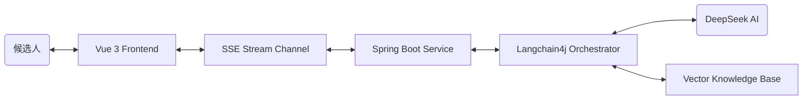

# AI 模拟面试系统 (AI Mock Interview System)

基于**大语言模型 (LLM)** 构建的专业技术模拟面试平台。该系统能够让候选人体验沉浸式的真实面试流程，支持多岗位选择、实时打字机流式问答对话，并在面试结束后由 AI 面试官出具全方位的求职评估报告。

---

## 🚀 项目概览 (Project Overview)

本项目旨在利用 AI 技术帮助求职者降低面试紧张感，提升技术表达能力。系统通过角色扮演 (Role-Playing) 技术，使大模型化身为专业面试官。候选人可以在模拟环境中不断试错，并在最后得到一份包含具体评分、能力雷达图与改进建议的报告。

### 主要功能模块
1. **📹 全双工视频面试**：支持开启摄像头，AI 具备定制化语音 (TTS) 与专属音色，你的声音会被静音识别并自动发送。
2. **🧠 岗位精准 RAG & 自适应难度**：基于本地知识库检索增强，且 AI 面试官会根据你的回答质量动态调整下一问的难度（深深挖或降维）。
3. **📄 专属简历靶向解析**：候选人由于可直接上传 PDF 简历，后端使用 `Apache PDFBox` 将文本交给 DeepSeek 提取出高维特征（匹配度仪、专属技能词云），并反向生成 3-5 道“专属于你的”杀手级考题。
4. **💬 动态多智能体演变调度**：面试全流程打破死板轮次，支持由 组长 → 技术面试官 → HR BP 自然过渡！由于系统实现了底层记忆流截断：若 AI 对求职者答复极其欣赏，甚至会触发“免死金牌”，输出 `[SWITCH_TO_HR]` 对 UI 和音轨引擎立刻进行无缝接管，提前直通 HR 终面！
5. **📊 面试诊断与情感分析**：面试结束后，不仅出具 A/B/C/D/E 六维雷达图评级与技能提升计划，还通过前端 `face-api.js` 在端侧生成情绪波动与自信指数报告。
6. **📈 星系全景图轨迹 (Knowledge Universe)**：除了能力图表外，后端会细粒度追踪每一场谈话提及的技术点，前端辅以 ECharts Force Graph （原力导向图），将你的所有薄弱/精通技能点连成一片繁星大海。

### 适用受众 (Target Audience)
- **高校应届生**：春招/秋招前用于克服面试恐惧，整理八股文表述结构。
- **初/中级开发人员**：在跳槽前用来检测技术盲区，熟悉新岗位的常见面试套路。
- **非开发类岗位求职者**：可通过后台扩展岗位配置，快速平移至产品经理、HR 面试练习等场景。

---

## 🛠 技术栈与架构 (Tech Stack)

### 核心架构图 (Conceptual Architecture)


### 技术实现深度
*   **后端 (Backend)**:
    *   **AI 编排**: 使用 `Langchain4j` 封装 RAG 流程。通过 `Metadata Filter` 实现岗位级别的知识路由（java/frontend/common 隔离）。
    *   **SSE 优化**: 针对 Spring Boot 的 `SseEmitter` 进行了 JSON 序列化转换，解决了原生字符串推送可能导致的 `HttpMessageNotWritableException`。
*   **前端 (Frontend)**:
    *   **响应式流处理**: 使用 Vue 3 的 `Reactive Proxy` 直接管理 SSE 数据流，实现高性能的 DOM 实时更新。
    *   **端侧多模态 AI**: 引入 `face-api.js` 在浏览器本地运行轻量化人脸识别模型，实时分析候选人情绪分布（且不上传视频流，保护隐私）。
    *   **极客级动画组件**: 完全采用原生 `Canvas API` 渲染多边形雷达图、颗粒感热力图与背景动效，兼顾高性能与视觉张力。

---

---

---

## ⚡ 快速开始 (推荐使用 Docker)

如果你安装了 **Docker** 和 **Docker Desktop**，可以使用以下命令实现“秒级”部署，无需手动配置复杂的开发环境。

### 1. 准备配置文件
在项目根目录下，将 `.env.example` 复制并重命名为 `.env`：
```bash
cp .env.example .env
```
打开 `.env` 文件，填入你的 **DEEPSEEK_API_KEY**。

### 2. 一键启动
在终端执行以下命令：
```bash
docker-compose up -d
```
> [!TIP]
> 如果你是第一次运行或修改了代码，建议使用 `docker-compose up --build -d` 强制重新构建。

### 3. 开始使用
- **访问地址**: `http://localhost`
- **默认管理员账号**: `admin`
- **默认初始密码**: `123456`

---

## 💻 本地手动开发环境 (Manual Setup)

如果您需要修改代码并进行本地调试，可以参考以下步骤：

### 1. 环境依赖
- **JDK 17+** | **Maven 3.6+**
- **Node.js 20+** | **NPM**
- **MySQL 5.7+** (推荐使用 Docker 内部数据库或小皮面板)

### 2. 数据库准备
1. 创建数据库 `ai_interview_ds`。
2. 导入初始化脚本：`mysql/init/init.sql`。

### 3. 后端启动 (Spring Boot)
1. 用 IDE 打开 `backend` 目录。
2. 配置 `application.yml` 或在环境变量中设置 `DEEPSEEK_API_KEY`。
3. 运行主类，成功后看到 `====== AI Interview Backend Started ======`。

### 4. 前端启动 (Vue 3)
```bash
cd frontend
npm install
npm run dev
```

---

## 📂 项目结构
```text
.
├── backend          # Spring Boot 后端工程
├── frontend         # Vue 3 前端工程
├── mysql            # 数据库初始化脚本
├── docker-compose.yml
└── .env.example     # 环境配置模板
```

---

## 📝 扩展说明
- **岗位扩展**: 在 `backend/src/main/resources/knowledge` 下添加文件夹（如 `python`）并放入文档，系统会自动向量化。
- **背景定制**: 前端 `Login.vue` 和 `Home.vue` 采用了高性能 Canvas 动画，可灵活调整粒子效果。

---