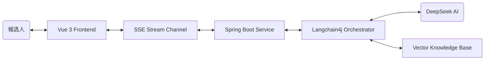

# AI 模拟面试系统 (AI Mock Interview System)

基于**大语言模型 (LLM)** 构建的专业技术模拟面试平台。该系统能够让候选人体验沉浸式的真实面试流程，支持多岗位选择、实时打字机流式问答对话，并在面试结束后由 AI 面试官出具全方位的求职评估报告。

---

## 🚀 项目概览 (Project Overview)

本项目旨在利用 AI 技术帮助求职者降低面试紧张感，提升技术表达能力。系统通过角色扮演 (Role-Playing) 技术，使大模型化身为专业面试官。候选人可以在模拟环境中不断试错，并在最后得到一份包含具体评分、能力雷达图与改进建议的报告。

### 主要功能模块
1. **🎙️ 语音面试交互**：支持 Web Speech 实时转写 (STT)，具备自动停止感应与动态波形反馈。
2. **🧠 岗位精准 RAG**：基于本地知识库的检索增强生成，实现不同岗位的题库隔离与专业问答。
3. **💬 沉浸式流式对话**：采用 SSE 技术实现逐字生成的“打字机”效果，响应迅速。
4. **📊 6A 全方位评估**：面试结束后，从专业深度、思考能力、知识储备等 6 个维度生成可视化雷达图。
5. **📈 历程与历史记录**：自动持久化面试对话，并绘制账号专属的能力成长曲线。

### 适用受众 (Target Audience)
- **高校应届生**：春招/秋招前用于克服面试恐惧，整理八股文表述结构。
- **初/中级开发人员**：在跳槽前用来检测技术盲区，熟悉新岗位的常见面试套路。
- **非开发类岗位求职者**：可通过后台扩展岗位配置，快速平移至产品经理、HR 面试练习等场景。

---

## 🛠 技术栈与架构 (Tech Stack)

### 核心架构图 (Conceptual Architecture)


### 技术实现深度
*   **后端 (Backend)**:
    *   **AI 编排**: 使用 `Langchain4j` 封装 RAG 流程。通过 `Metadata Filter` 实现岗位级别的知识路由（java/frontend/common 隔离）。
    *   **SSE 优化**: 针对 Spring Boot 的 `SseEmitter` 进行了 JSON 序列化转换，解决了原生字符串推送可能导致的 `HttpMessageNotWritableException`。
*   **前端 (Frontend)**:
    *   **响应式流处理**: 使用 Vue 3 的 `Reactive Proxy` 直接管理 SSE 数据流，实现高性能的 DOM 实时更新。
    *   **底层可视化**: 完全采用原生 `Canvas API` 渲染雷达图与音频波形，确保流畅的交互反馈体验。
    *   **时序分析**: 引入 `Chart.js` 绘制能力成长曲线。

---

## 💻 运行环境要求 (Prerequisites)

为了能够在本地成功运行此项目，你需要安装以下环境：
- **JDK 17** 及以上版本
- **Maven 3.6+** 官网链接:https://maven.apache.org/
- **Node.js 18+** 与 **npm** (用于前端运行) 链接:https://nodejs.org/en/download/
- **MySQL 8.0+** (用于数据存储)
- **phpstudy** (用于管理数据库,里面集成了mysql) 链接:https://www.xp.cn/download.html
- **DeepSeek API Key**  链接:https://platform.deepseek.com/

---

## 👨‍💻 启动指南 (Setup Instructions)

### 1. 数据库初始化 (使用小皮管理)

1. 启动本地 MySQL 服务 (在小皮面板点击启动)。
2. 在小皮创建一个名为 `ai_interview_ds` 的数据库实例。
3. **导入 SQL 文件**：在小皮的数据库管理工具（phpMyAdmin）中，将项目目录下的 `backend/src/main/resources/schema.sql` 内容粘贴到 SQL 窗口执行，或者使用“导入”功能选中该文件。
   - 默认管理员账号：`admin` / 密码：`123456`

### 2. 后端服务端启动 (Spring Boot) ps::前端后端分开运行，建议在idea中只打开backened，即后端文件夹，idea会自动识别maven框架，直接把interview文件打开可能不行
1. 使用 IntelliJ IDEA 或其他 IDE 打开 `backend` 目录。
2. 修改 `/backend/src/main/resources/application.yml` 配置文件：
   - 将 `spring.datasource.password` 修改为你的本机 MySQL 密码。
   - 填入你申请好的 **DeepSeek API 密钥** (替换 `langchain4j.open-ai.chat-model.api-key` 的值)。（可以去官网申请）(现在默认是我的，可以不改)
3. 直接运行，成功会出现（====== AI Interview Backend Started ======）

### 3. 前端客户端启动 (Vue 3) ps::报错大概率是没做好配置或者进错文件夹
1. 打开一个新的终端窗口cmd。
2. 进入前端代码根目录：
   ```bash
   cd 你存放该文件的位置/frontend
   ```
3. 安装所有的 npm 层依赖包：( # 如果你没删过 node_modules 文件夹的话，这句可以跳过不跑)
   ```bash
   npm install
   ```
4. 启动前端 Vite 开发服务器：
   ```bash
   npm run dev
   ```
5. 终端将会输出访问地址，通常为 `http://localhost:5174/`，在浏览器中打开即可

---

## 📝 扩展与二次开发
- **动态知识库**: 只需在 `backend/src/main/resources/knowledge` 下添加岗位文件夹（如 `python`），系统会自动将其向量化并隔离检索。
- **录音自适应**: 前端已在 `Interview.vue` 中封装了完整的 AudioContext 分析逻辑，可轻松扩展音频处理算法。
