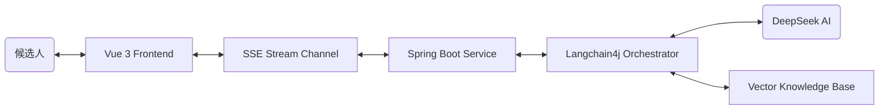

# AI 模拟面试系统 (AI Mock Interview System)

基于**大语言模型 (LLM)** 构建的专业技术模拟面试平台。该系统能够让候选人体验沉浸式的真实面试流程，支持多岗位选择、实时打字机流式问答对话，并在面试结束后由 AI 面试官出具全方位的求职评估报告。

---

##  项目概览 (Project Overview)

本项目旨在利用 AI 技术帮助求职者降低面试紧张感，提升技术表达能力。系统通过角色扮演 (Role-Playing) 技术，使大模型化身为专业面试官。候选人可以在模拟环境中不断试错，并在最后得到一份包含具体评分、能力雷达图与改进建议的报告。

### 主要功能模块
1. **📹 全双工视频面试**：支持开启摄像头，AI 具备定制化语音 (TTS) 与专属音色，你的声音会被静音识别并自动发送。
2. **🧠 岗位精准 RAG & 自适应难度**：基于本地知识库检索增强，且 AI 面试官会根据你的回答质量动态调整下一问的难度（深深挖或降维）。
3. **📄 专属简历靶向解析**：候选人由于可直接上传 PDF 简历，后端使用 `Apache PDFBox` 将文本交给 DeepSeek 提取出高维特征（匹配度仪、专属技能词云），并反向生成 3-5 道“专属于你的”杀手级考题。
4. **💬 动态多智能体演变调度**：面试全流程打破死板轮次，支持由 组长 → 技术面试官 → HR BP 自然过渡！由于系统实现了底层记忆流截断：若 AI 对求职者答复极其欣赏，甚至会触发“免死金牌”，输出 `[SWITCH_TO_HR]` 对 UI 和音轨引擎立刻进行无缝接管，提前直通 HR 终面！
5. **📊 面试诊断与情感分析**：面试结束后，不仅出具 A/B/C/D/E 六维雷达图评级与技能提升计划，还通过前端 `face-api.js` 在端侧生成情绪波动与自信指数报告。
6. **📈 星系全景图轨迹 (Knowledge Universe)**：除了能力图表外，后端会细粒度追踪每一场谈话提及的技术点，前端辅以 ECharts Force Graph （原力导向图），将你的所有薄弱/精通技能点连成一片繁星大海。

### 适用受众 (Target Audience)
- **高校应届生**：春招/秋招前用于克服面试恐惧，整理八股文表述结构。
- **初/中级开发人员**：在跳槽前用来检测技术盲区，熟悉新岗位的常见面试套路。
- **非开发类岗位求职者**：可通过后台扩展岗位配置，快速平移至产品经理、HR 面试练习等场景。

---

## 🛠 技术栈与架构 (Tech Stack)

### 核心架构图 (Conceptual Architecture)


### 技术实现深度

#### 1. 前端架构 (Vue 3 & 浏览器原生能力)
*   **实时流式呈现**: 基于 `EventSource` 封装轻量级 SSE 客户端，无缝承接后端 LLM 打字机输出流，配合自研的光标跟进算法，实现极低延迟的文字渲染。
*   **端侧多模态感知**: 
    *   **视觉（情绪）**: 深度集成轻量级计算机视觉库 `face-api.js`，完全在浏览器本地（端侧）进行实时人脸捕捉与 7 种情绪概率（Happy、Neutral、Sad 等）的矩阵运算，保护隐私且零网络开销。
    *   **听觉（语音）**: 接入 W3C `Web Speech API` 进行实时语音识别（Speech-to-Text）和静音帧检测（Silence Detection），自动打包语音区间并发送。
*   **数据可视化**: 封装 `ECharts` 引擎组件，将后端下发的离散情感点与能力维度的 JSON 数据映射为动态调整的雷达图与多维词云。

#### 2. 后端核心 (Spring Boot 3 & LangChain4j)
*   **多职能 Agent 状态机**: 抛弃单一的 System Prompt，后端会根据 `history.size()` 计算面试轮数，动态无缝切换协调员（开场）、技术长（硬实力追问）、HR（价值观定性）三套核心提示词模板。
*   **高斯向量 RAG (Retrieval-Augmented Generation)**: 借助 LangChain4j 内置的高性能内存向量库（In-Memory Embedding Store），对企业本地岗位题库进行切片向量化。通过 Metadata Filter 确保技术候选人与对应领域上下文的 100% 隔离。
*   **弹性会话状态机 (Dual-Mode Cache)**: 抽象出了底层 `ChatMemory` 接口，面对高并发的无状态 SSE 请求，系统优先将上下文序列化并托管至 `Redis` 集群存放（带 2小时 TTL）；并在检测不到 Redis 节点时，毫秒级降级至本地 JVM `ConcurrentHashMap`，兼顾了单节点极简调试与 K8s 集群弹性扩容。

#### 3. 架构工程与安全防护
*   **多范式鉴权体系**: 由于 EventSource 原生不支持携带 `Authorization` Header，后端的 `JwtInterceptor` 拦截器采用了复合探针设计（Header / URL Query 兼顾），通过 `ThreadLocal` 替代属性传递给下游 Controller，实现了多并发下的身份隔离。
*   **履历画像解析管道**: 支持 PDF 二进制流的上传分析。系统利用策略模式解析简历特征，随后通过 JSON 结构化抽取能力项以 UPSERT（有则更新，无则创建）模式存入 `resume_profile` 关系型数据表，实现持久化用户画像与“杀手级”定制跟问题库。
*   **DBA 自动化迭代**: 考虑到模型数据字段膨胀迅速，底层封装了 `DatabaseUpdater` 轻量级迁移脚本，基于 JDBC 静默扫描 `information_schema` 实现字段表的幂等添加，告别烦人的 `SQLSyntaxErrorException`。

---

##  快速开始 (推荐使用 Docker)

如果你安装了 **Docker** 和 **Docker Desktop**，可以使用以下命令实现“秒级”部署，一次性解决 MySQL、Redis、Java、Node、Nginx 的环境阵痛！

### 1. 克隆项目
```bash
git clone https://github.com/<your-username>/interview.git
cd interview
```

### 2. 准备配置文件
项目中的敏感配置已通过 `.gitignore` 隐藏，你需要从模板创建自己的配置：

```bash
# 复制环境变量模板
cp .env.example .env

# 复制 Docker Compose 配置模板
cp docker-compose.example.yml docker-compose.yml
```

打开 `.env` 文件，按注释提示填写以下关键配置：
```properties
DB_USERNAME=root                              # 数据库用户名
DB_PASSWORD=your_password_here                # 设置你的数据库密码
DEEPSEEK_API_KEY=your_deepseek_api_key_here   # DeepSeek API Key (必填，申请地址: https://platform.deepseek.com/)

MAIL_HOST=smtp.qq.com                         
MAIL_PORT=587
MAIL_USERNAME=your_email@qq.com               #qq邮箱
MAIL_PASSWORD=your_smtp_authorization_code    #授权码
```

### 3. 一键启动
在终端执行以下命令：
```bash
docker-compose up -d
```
> [!TIP]
> 如果你是代码变更后需要更新容器，执行 `docker-compose up --build -d`。

### 4. 开始使用
- **访问地址**: `http://localhost`
- **默认管理员账号**: `admin`
- **默认初始密码**: `123456`

---

##  本地手动开发环境 (Manual Setup)

如果您需要修改代码并进行本地调试，可以参考以下步骤：

### 1. 环境依赖
- **JDK 17+** | **Maven 3.6+**
- **Node.js 20+** | **NPM**
- **MySQL 5.7+** (推荐使用 Docker 内部数据库或小皮面板)
- **Redis 7+** (可选，未安装时系统自动降级为本地内存缓存)

### 2. 数据库准备
1. 创建数据库 `ai_interview_ds`。
2. 导入初始化脚本：`mysql/init/init.sql`。

### 3. 后端配置与启动 (Spring Boot)
1. 用 IDE 打开 `backend` 目录。
2. 复制配置模板并填入你的信息：
   ```bash
   cp backend/src/main/resources/application.yml.example backend/src/main/resources/application.yml
   ```
3. 编辑 `application.yml`，修改数据库连接与 DeepSeek API Key：
   ```yaml
   spring:
     datasource:
       username: root                    # 你的数据库用户名
       password: your_password_here      # 你的数据库密码
   langchain4j:
     open-ai:
       chat-model:
         api-key: your_deepseek_api_key  # 你的 DeepSeek API Key
   ```
4. 运行主类，成功后看到 `====== AI Interview Backend Started ======`。

### 4. 前端启动 (Vue 3)
```bash
cd frontend
npm install
npm run dev
```

---

##  项目结构
```text
.
├── backend/                # Spring Boot 核心，包含 LC4J 知识库和所有核心逻辑
├── frontend/               # Vue3 + Element Plus 的纯净重写界面
├── mysql/                  # 初始化元初数据脚本
├── document/               # 默认技术岗位知识库源文档，及PDFBox解析插件
├── image/                  # 项目截图
├── docker-compose.example.yml   # Docker Compose 配置模板（复制为 docker-compose.yml 使用）
├── .env.example                 # 环境变量模板（复制为 .env 使用）
└── backend/src/main/resources/
    └── application.yml.example  # Spring Boot 配置模板（本地开发时复制为 application.yml）
```

---

##  扩展说明
- **岗位扩展**: 在 `backend/src/main/resources/knowledge` 下添加文件夹（如 `python`）并放入文档，系统会自动向量化。