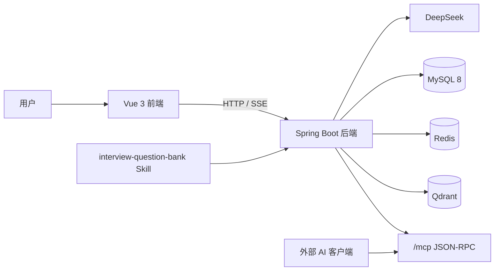
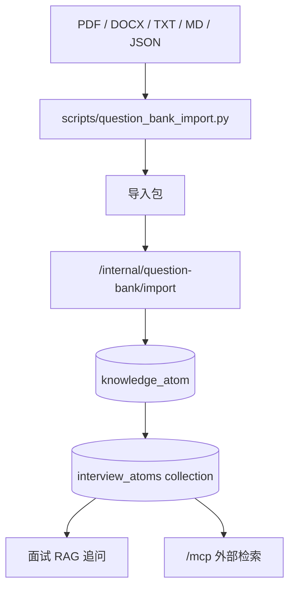

# InterWise AI 模拟面试系统

InterWise 是一个面向技术面试训练的 AI 模拟面试平台。项目采用 `Spring Boot 3 + MyBatis-Plus + LangChain4j + DeepSeek + Redis + MySQL 8 + Qdrant` 构建后端，前端使用 `Vue 3 + Vite + Element Plus`。系统支持文字面试、视频面试、简历画像、RAG 追问、面试复盘、AI Mentor、数据库题库维护，以及可供外部 AI 客户端调用的 MCP 题库服务。

当前版本已经移除默认 `admin / 123456` 登录方式。用户需要正常注册登录；题库维护通过开发者 token、Skill 或 MCP 管理入口完成。

## 核心能力

- 文字 / 视频双模式面试：支持 SSE 流式回答、语音识别、语音播报、摄像头情绪分析。
- 多角色面试流程：基于 `InterviewPhase` 状态机在开场、技术、HR、收尾和结束阶段流转。
- 岗位化追问：结合岗位、难度、重点能力、简历画像和题库检索生成追问。
- 数据库题库：知识原子落入 MySQL，发布后的题目同步到 Qdrant，供 RAG 和 MCP 检索。
- MCP 外部服务：通过 `/mcp` 暴露题库搜索、上下文生成、分类查询、导入校验、导入发布和重建索引工具。
- 题库维护 Skill：`skills/interview-question-bank` 支持从 PDF、DOCX、TXT、MD、JSON 生成导入包，并调用项目 API 发布。
- 简历画像：PDF 简历解析后写入 `resume_profile`，前端以服务端状态为准，避免旧浏览器缓存误用。
- AI Mentor：聚合面试历史、知识覆盖、风险提醒和行动建议，Redis 缓存 24 小时并支持刷新。
- 访问统计与成本保护：记录页面访问、关键行为、反馈、异常和限流命中；使用 Redis + MySQL 快照限制每日 AI 面试、对话、简历解析和 Mentor 生成额度。
- Docker 本地启动：`frontend + backend + mysql + redis + qdrant` 一键编排。

## 技术栈

### 后端

- Java 17
- Spring Boot 3.2.4
- MyBatis-Plus 3.5.5
- LangChain4j 0.29.1
- DeepSeek API
- AllMiniLmL6V2 Embedding Model
- MySQL 8.0
- Redis 7
- Qdrant
- Flyway 9.22.3
- Apache PDFBox
- Fastjson2
- JJWT

### 前端

- Vue 3.5
- Vite 7
- Element Plus
- Axios
- ECharts / echarts-wordcloud
- face-api.js
- Web Speech API

## 架构概览



## 主要目录

```text
.
├── backend/
│   ├── src/main/java/com/interview/
│   │   ├── config/                 # LLM、Redis、Prompt、岗位分类、JWT 配置
│   │   ├── controller/             # REST API、MCP、题库维护接口
│   │   ├── dto/                    # 请求 / 响应 DTO
│   │   ├── entity/                 # MySQL 实体与 InterviewPhase
│   │   ├── mapper/                 # MyBatis-Plus Mapper
│   │   ├── service/                # 面试、简历、Mentor、RAG、题库服务
│   │   └── utils/                  # JwtUtils 等工具
│   └── src/main/resources/
│       ├── db/migration/           # Flyway 迁移，V1 - V7
│       └── knowledge_base/atoms/   # 旧 JSON 题库种子，启动时可导入数据库
├── frontend/
│   └── src/
│       ├── views/                  # 首页、面试、视频面试、简历、历史、Mentor、设置
│       ├── components/             # dashboard、layout 等组件
│       ├── api/                    # Axios API 封装
│       └── utils/                  # auth、request、interviewEntry
├── mysql/init/init.sql             # Docker 首次初始化脚本
├── scripts/
│   ├── question_bank_import.py     # PDF/DOCX/TXT/MD/JSON -> 题库导入包
│   ├── atomizer.py                 # 旧知识原子生成脚本
│   └── reclassify_hot200.py        # 旧题库分类整理脚本
├── skills/interview-question-bank/ # Codex 题库维护 Skill
├── docker-compose.example.yml      # 本地 Docker Compose 模板
├── docker-compose.prod.yml         # 生产部署模板
├── .env.example                    # 环境变量模板
└── README.md
```

## 快速启动

### 1. 准备环境

- Docker Desktop / Docker Compose
- 可用的 DeepSeek API Key
- 如需注册和找回密码，准备 SMTP 邮箱授权码

### 2. 创建配置文件

```powershell
Copy-Item .env.example .env
Copy-Item docker-compose.example.yml docker-compose.yml
```

至少补齐：

```env
DB_PASSWORD=your_mysql_password
DEEPSEEK_API_KEY=your_deepseek_api_key
JWT_SIGN_KEY=your_jwt_signing_key_at_least_32_characters
QUESTION_BANK_ADMIN_TOKEN=your_strong_admin_token
MCP_READ_TOKEN=your_strong_read_token
APP_ADMIN_TOKEN=your_strong_ops_admin_token
APP_ANALYTICS_HASH_SALT=your_strong_analytics_hash_salt
MAIL_USERNAME=your_email@qq.com
MAIL_PASSWORD=your_smtp_authorization_code
```

`QUESTION_BANK_ADMIN_TOKEN` 用于开发者维护题库；`MCP_READ_TOKEN` 用于外部 AI 客户端只读调用 MCP。生产环境请使用强随机值。
`APP_ADMIN_TOKEN` 用于前端 Operations 统计页和管理反馈接口；不要把真实值写入代码或提交到 Git。

### 3. 启动

```powershell
docker compose up -d --build
```

默认访问：

- 前端：`http://localhost`
- 后端：`http://localhost:8080`
- MySQL：`localhost:13307`
- Redis：`localhost:6379`
- Qdrant：`http://localhost:6333`
- MCP：`http://localhost:8080/mcp`

如果 Windows 提示端口不可用，优先检查 Docker Desktop 是否已启动，以及本机端口是否被占用或被系统排除。

## 数据库与迁移

项目以 MySQL 8.0 为当前标准数据库版本。首次启动时：

1. `mysql/init/init.sql` 创建基础表。
2. Flyway 自动执行 `backend/src/main/resources/db/migration` 下的版本迁移。
3. `V6__add_question_bank.sql` 创建题库相关表。
4. `V7__add_analytics_rate_limit_tables.sql` 创建访问事件、每日额度和反馈表。
5. 当 `QUESTION_BANK_SEED_FROM_JSON=true` 且题库为空时，后端会从 `knowledge_base/atoms/**/*.json` 导入题库种子。

当前题库导入逻辑会跳过旧 JSON 中重复的 `atom_id`，唯一题目发布后会同步到 Qdrant。

## 题库、Qdrant 与 MCP

### 题库数据流



### 内部维护 API

所有内部题库 API 需要 `X-Question-Bank-Token`：

- `POST /internal/question-bank/search`
- `GET /internal/question-bank/atoms/{atomId}`
- `GET /internal/question-bank/categories`
- `POST /internal/question-bank/import`
- `POST /internal/question-bank/reindex`

### MCP 工具

MCP 使用 JSON-RPC，读操作使用 `Authorization: Bearer <MCP_READ_TOKEN>`，写操作使用管理员 token。当前工具包括：

- `search_interview_atoms`
- `get_interview_atom`
- `list_interview_categories`
- `generate_interview_context`
- `validate_atom_import_package`
- `submit_atom_import_package`
- `reindex_question_bank`

初始化示例：

```powershell
$body = @{ jsonrpc='2.0'; id=1; method='initialize' } | ConvertTo-Json -Compress
Invoke-WebRequest -Uri 'http://localhost:8080/mcp' -Method POST -ContentType 'application/json' -Body $body
```

## 题库维护 Skill

仓库内置 Skill：

```text
skills/interview-question-bank/
```

它的定位是给开发者维护私有题库使用，而不是给普通用户开放后台。典型流程：

1. 准备 PDF、DOCX、TXT、MD 或 JSON 资料。
2. 使用 `scripts/question_bank_import.py` 生成导入包。
3. 按需评审导入包。
4. 使用 `DRAFT` 暂存，或使用 `AUTO_PUBLISH` 直接发布并同步 Qdrant。
5. 通过内部 API 或 MCP 搜索验证。

示例：

```powershell
python scripts/question_bank_import.py --input .\materials\redis.pdf --category redis --mode DRAFT
```

直接发布：

```powershell
$env:QUESTION_BANK_ADMIN_TOKEN="your-token"
python scripts/question_bank_import.py --input .\materials\java --category java --mode AUTO_PUBLISH --submit
```
## 说明
mcp 和 skill现已放在新仓库中

## 本地开发

### 后端

```powershell
cd backend
mvn spring-boot:run
```

本地后端需要配置：

- MySQL 8.0
- Redis
- Qdrant
- DeepSeek API Key
- JWT 签名密钥
- 可选 SMTP 邮箱

### 前端

```powershell
cd frontend
npm install
npm run dev
```

前端通过 `VITE_API_BASE_URL` 指向后端，默认可使用 `.env.example` 中的 `http://localhost:8080`。

## 验证命令

后端测试：

```powershell
cd backend
mvn test
```

前端构建：

```powershell
cd frontend
npm run build
```

前端单测：

```powershell
cd frontend
npm exec vitest -- --run
```

当前项目在 Windows 环境中偶尔会遇到 Vitest / esbuild `spawn EPERM`，通常提升权限重跑即可。

## 访问统计、限流与每日额度

生产默认开启接口限流和每日 AI 成本额度：

- 登录、注册、验证码、重置密码、开始面试、AI 对话、报告生成、简历解析、Mentor 刷新、反馈提交和 MCP 请求都会按 IP 或用户维度限流。
- 每个登录用户默认每日额度：开始面试 5 次、AI 对话 80 轮、简历解析 3 次、AI Mentor 生成 3 次。
- 超限统一返回 `429` 和友好提示，例如“今日 AI 对话额度已用完，请明天再试”。
- 页面访问、登录注册、面试开始/结束、报告查看、反馈、异常和限流命中会写入 `app_event_log`。
- 额度使用会同步到 `user_daily_usage`，反馈写入 `user_feedback`。

相关环境变量：

```env
APP_ADMIN_TOKEN=replace_with_a_strong_admin_analytics_token
APP_ANALYTICS_HASH_SALT=replace_with_a_long_random_analytics_hash_salt
APP_RATE_LIMIT_ENABLED=true
APP_QUOTA_ENABLED=true
APP_DAILY_INTERVIEW_LIMIT=5
APP_DAILY_AI_CHAT_TURN_LIMIT=80
APP_DAILY_RESUME_PARSE_LIMIT=3
APP_DAILY_MENTOR_GENERATE_LIMIT=3
```

登录后访问 `/admin/analytics`，输入 `APP_ADMIN_TOKEN` 可查看 PV、UV、注册、登录、面试完成率、限流命中、今日额度使用和最新反馈。

## Azure 云端服务器部署
- 该项目已完成 Azure 云端部署，当前内测地址为 https://interwise.japaneast.cloudapp.azure.com
