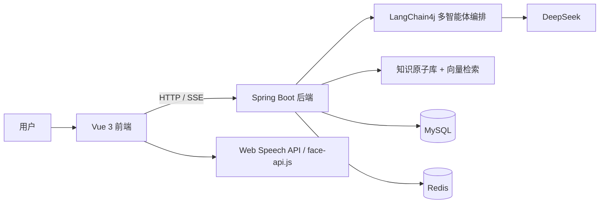

# InterWise AI 模拟面试系统

基于 `Spring Boot 3 + Vue 3 + LangChain4j + DeepSeek` 的多智能体 AI 模拟面试平台，支持文字/视频面试、RAG 检索增强追问、简历画像分析、知识星图、历史成长分析，以及基于 Redis 的会话缓存与 Docker 一键部署。

## 项目简介

InterWise 的目标不是做一个“会提问题的聊天机器人”，而是尽量还原一场完整、连续、可复盘的技术面试过程。系统当前已经打通以下主链路：

- 多智能体轮转面试：主考官 `Coordinator`、技术官 `TechLead`、`HR BP` 按轮次自动切换。
- 岗位化 RAG 追问：基于重构后的知识原子库进行语义检索，并按岗位路由追问。
- 文字与视频双模式：支持普通文字面试，也支持摄像头 + 麦克风的视频模式。
- 端侧情感分析：使用 `face-api.js` 在浏览器本地完成表情识别，减少敏感数据外传。
- 简历解析画像：上传 PDF 简历后生成结构化画像、匹配度评估和定制追问题。
- 面试报告与历史成长：生成六维能力评级、知识星图、成长热力图、综合得分趋势等结果。

## 当前版本亮点

- 知识库已重构为 `knowledge_base/atoms` 原子化目录结构，便于岗位级检索与扩展。
- 后端已接入 `Redis 7`，用于会话缓存与容灾降级。
- JWT 鉴权已适配普通接口与 SSE 场景。
- 简历画像已落库到 `resume_profile` 表，不再只依赖本地缓存。
- 历史分析页已支持综合得分、热力图、知识星图三种视图切换。

## 功能概览

### 1. 智能面试主流程

- 主考官开场，自我介绍与岗位确认。
- 技术官进入多轮技术压测，结合 RAG 与简历题库动态追问。
- HR BP 负责职业规划、沟通协作、稳定性等软技能考察。
- 面试结束后自动生成结构化报告。

### 2. RAG 检索增强

- 使用 `AllMiniLmL6V2` 对知识原子进行向量化。
- 使用 `InMemoryEmbeddingStore` 进行内存级语义检索。
- 使用 `Metadata Filter` 按岗位隔离知识范围。
- 支持已使用原子黑名单，避免重复追问同一知识点。

### 3. 多模态交互

- `SSE` 流式输出 AI 回复。
- `Web Speech API` 实现语音识别与语音播报。
- `face-api.js` 实现端侧表情识别与情感分布统计。

### 4. 简历画像分析

- 解析 PDF 简历内容。
- 生成匹配度评估、技能云、项目摘要、定制追问题。
- 持久化存储到 `resume_profile` 表，后续可直接复用。

### 5. 报告与复盘

- 六维能力评级。
- 情感分析报告。
- 历史成长热力图。
- 综合得分趋势图。
- 知识星图。

## 技术栈

### 后端

- Java 17
- Spring Boot 3.2.4
- MyBatis-Plus 3.5.5
- LangChain4j 0.29.1
- DeepSeek API
- AllMiniLmL6V2 Embedding Model
- Fastjson2 2.0.47
- JJWT 0.9.1
- Apache PDFBox 2.0.29
- Redis 7
- MySQL 5.7

### 前端

- Vue 3.5.25
- Vite 7.3.1
- Element Plus 2.13.5
- Axios 1.13.6
- ECharts 6.0.0
- `echarts-wordcloud`
- `face-api.js` 0.22.2
- Web Speech API

### 部署

- Docker Compose
- Nginx
- 四容器编排：`frontend + backend + db + redis`

## 架构示意



## 快速开始

### 1. 准备环境

需要安装：

- Docker
- Docker Compose / Docker Desktop

### 2. 配置 `.env`

项目根目录已经提供 `.env.example`：

```powershell
Copy-Item .env.example .env
```

至少需要补齐以下配置：

```env
DEEPSEEK_API_KEY=your_deepseek_api_key_here
MAIL_HOST=smtp.qq.com
MAIL_PORT=587
MAIL_USERNAME=your_email@qq.com
MAIL_PASSWORD=your_smtp_authorization_code
```

如果直接使用当前 `docker-compose.yml`，建议同时确认数据库用户名与密码配置一致。

### 3. 启动项目

```powershell
docker-compose up -d --build
```

启动后默认访问地址：

- 前端：`http://localhost`
- 后端：`http://localhost:8080`
- MySQL（宿主机端口）：`3307`
- Redis：`6379`

### 4. 默认账号

- 用户名：`admin`
- 密码：`123456`

## 本地开发

### 1. 基础依赖

- JDK 17+
- Maven 3.9+
- Node.js 20+
- MySQL 5.7+
- Redis 7+（可选，不启用时系统会降级到本地内存缓存）

### 2. 初始化数据库

执行：

```sql
mysql/init/init.sql
```

该脚本会创建并初始化：

- `user`
- `interview_record`
- `resume_profile`

### 3. 启动后端

复制配置文件：

```powershell
Copy-Item backend/src/main/resources/application.yml.example backend/src/main/resources/application.yml
```

然后修改：

- 数据库连接
- Redis 连接
- `DEEPSEEK_API_KEY`
- 邮件服务配置

启动后端：

```powershell
cd backend
mvn spring-boot:run
```

### 4. 启动前端

```powershell
cd frontend
npm install
npm run dev
```

开发环境默认是 Vite 本地服务，前端通过 `VITE_API_BASE_URL` 指向后端接口。

## 目录结构

```text
.
├── backend/                          # Spring Boot 后端
│   ├── src/main/java/com/interview/
│   │   ├── agent/                    # 多智能体角色定义
│   │   ├── config/                   # JWT / Redis / Chat 配置
│   │   ├── controller/               # REST API
│   │   ├── entity/                   # 数据实体
│   │   ├── mapper/                   # MyBatis-Plus Mapper
│   │   ├── service/                  # 业务服务
│   │   └── utils/                    # JWT 等工具类
│   └── src/main/resources/
│       ├── application.yml.example
│       └── knowledge_base/
│           ├── archive_original/     # 原始知识资料
│           └── atoms/                # 当前知识原子库
├── frontend/                         # Vue 3 前端
│   └── src/views/                    # 登录、首页、面试、历史、简历分析等页面
├── mysql/
│   └── init/init.sql                 # 初始化数据库脚本
├── scripts/
│   └── atomizer.py                   # 原始资料 -> 知识原子 JSON
├── document/                         # 项目文档与方案材料
├── image/                            # 截图、图表与文档配图
├── docker-compose.yml                # 当前 Docker 编排配置
├── docker-compose.example.yml        # Docker 编排模板
├── .env.example                      # 环境变量模板
└── README.md
```

## 知识库说明

当前知识库采用“知识原子”方案，目录位于：

```text
backend/src/main/resources/knowledge_base/atoms/
```

典型结构如下：

```text
atoms/
├── common/
├── frontend/
│   └── hot200/
└── java_backend/
    ├── hot200/
    ├── mysql/
    ├── redis/
    ├── spring/
    ├── springboot/
    ├── 并发/
    └── 操作系统/
```

每个知识原子都是一个 JSON 文件，包含：

- `id`
- `subject`
- `category`
- `difficulty`
- `tags`
- `content.principles`
- `content.pitfalls`
- `content.follow_up_paths`

## 扩展知识库

如果要把新的 PDF / DOCX / TXT / MD 文档转换成知识原子，可以使用：

```powershell
python scripts/atomizer.py -f "你的文档路径" -c "目标分类"
```

例如：

```powershell
python scripts/atomizer.py -f "docs/mysql.pdf" -c "mysql"
```

生成后的 JSON 会写入：

```text
backend/src/main/resources/knowledge_base/atoms/<category>/
```

重启后端后会自动被加载进向量检索流程。

## 说明

- 视频模式依赖浏览器麦克风和摄像头权限。
- 邮件注册 / 忘记密码依赖有效 SMTP 配置。
- DeepSeek API Key 未配置时，面试主流程无法正常工作。
- Redis 未启动时，系统会自动降级，但不建议在演示环境长期关闭。
