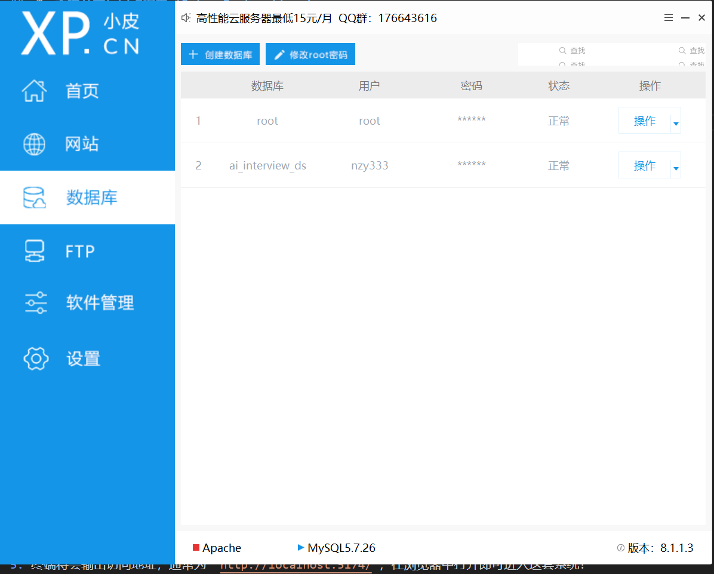

# AI 模拟面试系统 (AI Mock Interview System)

基于**大语言模型 (LLM)** 构建的专业技术模拟面试平台。该系统能够让候选人体验沉浸式的真实面试流程，支持多岗位选择、实时打字机流式问答对话，并在面试结束后由 AI 面试官出具全方位的求职评估报告。

---

## 🚀 项目概览 (Project Overview)

本项目旨在利用最新的人工智能技术，帮助求职者降低面试紧张感，提升技术表达能力。系统通过角色扮演 (Role-Playing) 技术，使大模型化身为严格但也循循善诱的面试官。候选人可以在模拟环境中不断试错，并在最后得到一份包含具体评分与改进建议的报告。

### 主要功能模块
1. **用户认证体系**：基于 JWT/Session 的简单登录与注册功能。
2. **多岗位面试大厅**：目前内置 Java 后端开发、前端开发岗位，可随时选择开考。
3. **沉浸式 AI 对话流体验**：采用 `Server-Sent Events (SSE)` 流式技术，实现大模型逐字生成的真实“打字机”输出效果，响应迅速，互动感极强。
4. **全方位评估报告**：面试结束后，AI 将对整场对话的上下文进行深度分析，出具带具体百分制分数、优缺点点评的最终总结报告。
5. **历史数据沉淀**：自动持久化保存每一场面试对话的历史记录到数据库，方便追溯。

### 适用受众 (Target Audience)
- **高校应届生**：春招/秋招前用于克服面试恐惧，整理八股文表述结构。
- **初/中级开发人员**：在跳槽前用来检测技术盲区，熟悉新岗位的常见面试套路。
- **非开发类岗位求职者**：可通过后台扩展岗位配置，快速平移至产品经理、HR 面试练习等场景。

---

## 🛠 技术栈与架构 (Tech Stack)

项目采用**前后端分离**架构，并且通过 Langchain4j 无缝集成了大语言模型能力。

### 核心后端 (Backend)
- **核心框架**: Spring Boot 3 + Java 17
- **持久层框架**: MyBatis-Plus
- **数据库**: MySQL 8+
- **AI 编排框架**: [Langchain4j](https://docs.langchain4j.dev/) (用于模型接口调用、记忆管理 ChatMemory)
- **流式传输**: Spring MVC `SseEmitter` + 高效的 Fastjson2 数据序列化
- **构建工具**: Maven

### 核心前端 (Frontend)
- **核心框架**: Vue 3 (Composition API) + Vite
- **UI 组件库**: Element Plus
- **前端路由**: Vue Router (SPA单页应用)
- **网络请求**: Axios + 浏览器原生 `EventSource` (用于接收 SSE 文本流)

---

## 💻 运行环境要求 (Prerequisites)

为了能够在本地成功运行此项目，你需要安装以下环境：
- **JDK 17** 及以上版本
- **Maven 3.6+** 官网链接:https://maven.apache.org/
- **Node.js 18+** 与 **npm** (用于前端运行) 链接:https://nodejs.org/en/download/
- **MySQL 8.0+** (用于数据存储)
- **phpstudy** (用于管理数据库,里面集成了mysql) 链接:https://www.xp.cn/download.html
- **DeepSeek API Key**  链接:https://platform.deepseek.com/

---

## 👨‍💻 本地开发与启动指南 (Setup Instructions)

### 1. 数据库初始化(使用phpstudy(小皮)来更轻松地数据库)

1. 启动本地 MySQL 服务。(这里指启动小皮)
2. 在小皮创建名为 `ai_interview_ds` 的数据库实例。
3. 导入项目提供的 `/backend/src/main/resources/schema.sql` 脚本，它会自动创建 `user` 表与 `interview_record` 表，并写入一个测试 admin 用户。ps::默认用户名：admin ， 密码：123456

### 2. 后端服务端启动 (Spring Boot) ps::前端后端分开运行，建议在idea中只打开backened，即后端文件夹，idea会自动识别maven框架，直接把interview文件打开可能不行
1. 使用 IntelliJ IDEA 或其他 IDE 打开 `backend` 目录。
2. 修改 `/backend/src/main/resources/application.yml` 配置文件：
   - 将 `spring.datasource.password` 修改为你的本机 MySQL 密码。
   - 填入你申请好的 **DeepSeek API 密钥** (替换 `langchain4j.open-ai.chat-model.api-key` 的值)。（可以去官网申请）(现在默认是我的，可以不改)
3. 直接运行，成功会出现（====== AI Interview Backend Started ======）

### 3. 前端客户端启动 (Vue 3) ps::报错大概率是没做好配置或者进错文件夹
1. 打开一个新的终端窗口cmd。
2. 进入前端代码根目录：
   ```bash
   cd 你存放该文件的位置/frontend
   ```
3. 安装所有的 npm 层依赖包：( # 如果你没删过 node_modules 文件夹的话，这句可以跳过不跑)
   ```bash
   npm install
   ```
4. 启动前端 Vite 开发服务器：
   ```bash
   npm run dev
   ```
5. 终端将会输出访问地址，通常为 `http://localhost:5174/`，在浏览器中打开即可

---

## 📝 二次开发说明与扩展点 (Future Enhancements)
- **引入知识库 (RAG)**：目前的面试官是不带限定题库的自由发挥（Zero-Shot）。未来如果你想指定问某家大厂的真题，可以借助 Langchain4j 引入向量数据库 (VectorStore) 读取题库。
- **添加录音功能 (STT/TTS)**：前端可调用 Web Audio API 收集用户的语音并转写成文字发给后端，后端回复可接入 TTS(文字转语音)，将其彻底变成真实的“仿真人视频面试系统”。
