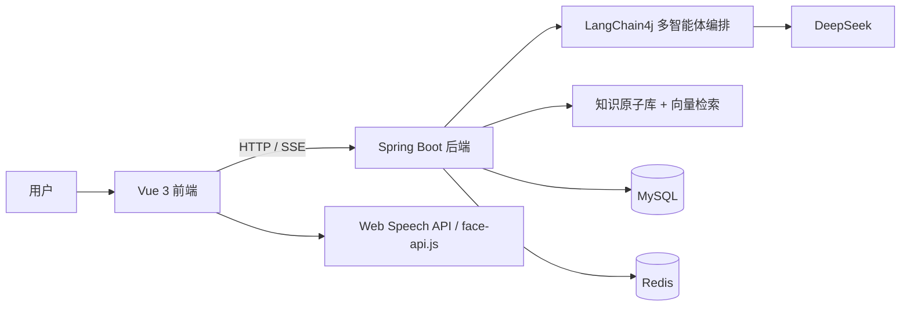

# InterWise AI 模拟面试系统

基于 `Spring Boot 3 + Vue 3 + LangChain4j + DeepSeek` 的多智能体 AI 模拟面试平台，支持文字/视频面试、RAG 检索增强追问、简历画像分析、知识星图、历史成长分析，以及基于 Redis 的会话缓存与 Docker 一键部署。

## 项目简介

InterWise 的目标不是做一个“会提问题的聊天机器人”，而是尽量还原一场完整、连续、可复盘的技术面试过程。系统当前已经打通以下主链路：

- 多智能体轮转面试：面试组长 → 技术面试官 → HR BP 按显式状态机 `OPENING → TECHNICAL → HR → CLOSING → FINISHED` 自动轮转。
- 岗位化 RAG 追问：基于重构后的知识原子库进行语义检索，并按岗位路由追问。
- 文字与视频双模式：支持普通文字面试，也支持摄像头 + 麦克风的视频模式。
- 端侧情感分析：使用 `face-api.js` 在浏览器本地完成表情识别，减少敏感数据外传。
- 简历解析画像：上传 PDF 简历后生成结构化画像、匹配度评估和定制追问题。
- 面试报告与历史成长：生成六维能力评级、知识星图、成长热力图、综合得分趋势等结果。

## 当前版本亮点

- 知识库已重构为 `knowledge_base/atoms` 原子化目录结构，当前共 `889` 个知识原子，便于岗位级检索与扩展。
- 岗位-分类映射通过 `application.yml` 外部化配置，新增岗位无需改代码。
- AI 提示词集中管理在 `application.yml`，无需重新编译即可调整。
- 显式面试阶段状态机，阶段持久化到数据库，SSE 断连不影响流程。
- 后端已接入 `Redis 7`，用于会话缓存与容灾降级；`SessionStore` 封装双模存储与并发安全。
- JWT 签名密钥通过环境变量 `JWT_SIGN_KEY` 注入，无硬编码凭据。
- Flyway 版本化数据库迁移，替代运行时 `ALTER TABLE`。
- `InterviewServiceImpl` 从 610 行拆分为 `SessionStore`、`RagRetriever`、`EvaluationGenerator` 三个独立模块。
- 简历画像已落库到 `resume_profile` 表，不再只依赖本地缓存。
- 历史分析页已支持综合得分、热力图、知识星图三种视图切换。
- **用户中心**：支持头像上传、昵称修改、密码修改、退出登录，偏好设置（模式/岗位/难度/重点能力）自动同步到面试准备页。
- **AI Mentor 智能教练**：独立的综合分析页面，聚合优势/待提升/风险预警/建议行动/知识领域覆盖，支持手动刷新。

## 功能概览

### 1. 智能面试主流程

- 主考官开场，自我介绍与岗位确认。
- 技术官进入多轮技术压测，结合 RAG 与简历题库动态追问。
- HR BP 负责职业规划、沟通协作、稳定性等软技能考察。
- 面试结束后自动生成结构化报告。

### 2. RAG 检索增强

- 使用 `AllMiniLmL6V2` 对知识原子进行向量化。
- 使用 `InMemoryEmbeddingStore` 进行内存级语义检索。
- 使用 `Metadata Filter` 按岗位隔离知识范围，岗位-分类映射通过 `position-categories` 配置驱动。
- 使用正则词边界匹配（如 `Javascript` 不会误匹配 `java` 规则）。
- 支持已使用原子黑名单，原子追加操作线程安全，避免重复追问同一知识点。

### 3. 多模态交互

- `SSE` 流式输出 AI 回复。
- `Web Speech API` 实现语音识别与语音播报。
- `face-api.js` 实现端侧表情识别与情感分布统计。

### 4. 简历画像分析

- 解析 PDF 简历内容。
- 生成匹配度评估、技能云、项目摘要、定制追问题。
- 持久化存储到 `resume_profile` 表，后续可直接复用。

### 5. 报告与复盘

- 六维能力评级。
- 情感分析报告。
- 历史成长热力图。
- 综合得分趋势图。
- 知识星图。

### 6. AI Mentor 智能教练

- 基于面试历史数据的综合诊断分析（优势 / 待提升）。
- 风险预警与分级建议行动（立即 / 短期 / 长期）。
- 知识领域覆盖度可视化，标注各技术领域的掌握程度。
- 支持手动刷新，绕过 24 小时缓存重新生成分析报告。

### 7. 用户中心与偏好管理

- **账号管理**：头像上传（PNG / JPG / WebP）、展示昵称修改、邮箱绑定、密码修改。
- **面试偏好**：默认模式（文字/视频）、默认岗位、难度倾向（应届 ~ 5 年+）、重点能力多选。
- **偏好同步**：Settings 保存后自动同步到面试准备页，Setup 中的选择变更也会自动回写偏好。
- **退出登录**：一键清除登录态及本地缓存。

## 技术栈

### 后端

- Java 17
- Spring Boot 3.2.4
- MyBatis-Plus 3.5.5
- LangChain4j 0.29.1
- DeepSeek API
- AllMiniLmL6V2 Embedding Model
- Fastjson2 2.0.47
- JJWT 0.9.1
- Apache PDFBox 2.0.29
- Flyway 9.22.3（数据库迁移）
- Redis 7
- MySQL 8.0

### 前端

- Vue 3.5.25
- Vite 7.3.1
- Element Plus 2.13.5
- Axios 1.13.6
- ECharts 6.0.0
- `echarts-wordcloud`
- `face-api.js` 0.22.2
- Web Speech API

### 部署

- Docker Compose
- Nginx
- 四容器编排：`frontend + backend + db + redis`

## 架构示意



## 快速开始

### 1. 准备环境

需要安装：

- Docker
- Docker Compose / Docker Desktop

### 2. 配置 `.env`

项目根目录已经提供 `.env.example`：

```powershell
Copy-Item .env.example .env
```

至少需要补齐以下配置：

```env
DEEPSEEK_API_KEY=your_deepseek_api_key_here
MAIL_HOST=smtp.qq.com
MAIL_PORT=587
MAIL_USERNAME=your_email@qq.com
MAIL_PASSWORD=your_smtp_authorization_code
```

如果直接使用当前 `docker-compose.yml`，建议同时确认数据库用户名与密码配置一致。

### 3. 启动项目

```powershell
docker-compose up -d --build
```

启动后默认访问地址：

- 前端：`http://localhost`
- 后端：`http://localhost:8080`
- MySQL（宿主机端口）：`3307`
- Redis：`6379`

### 4. 默认账号

- 用户名：`admin`
- 密码：`123456`

## 本地开发

### 1. 基础依赖

- JDK 17+
- Maven 3.9+
- Node.js 20+
- MySQL 8.0+
- Redis 7+（可选，不启用时系统会降级到本地内存缓存）

### 2. 初始化数据库

执行：

```sql
mysql/init/init.sql
```

该脚本会创建并初始化：

- `user`
- `interview_record`
- `resume_profile`

### 3. 启动后端

复制配置文件：

```powershell
Copy-Item backend/src/main/resources/application.yml.example backend/src/main/resources/application.yml
```

然后修改：

- 数据库连接
- Redis 连接
- `DEEPSEEK_API_KEY`
- 邮件服务配置

启动后端：

```powershell
cd backend
mvn spring-boot:run
```

### 4. 启动前端

```powershell
cd frontend
npm install
npm run dev
```

开发环境默认是 Vite 本地服务，前端通过 `VITE_API_BASE_URL` 指向后端接口。

## 目录结构

```text
.
├── backend/                          # Spring Boot 后端
│   ├── src/main/java/com/interview/
│   │   ├── config/                   # ChatConfig / InterviewPrompts / PositionCategoryConfig / JWT
│   │   ├── controller/               # REST API
│   │   ├── dto/                      # 请求 DTO（含 @Valid 验证）
│   │   ├── entity/                   # 数据实体 + InterviewPhase 枚举
│   │   ├── mapper/                   # MyBatis-Plus Mapper
│   │   ├── service/                  # SessionStore / RagRetriever / EvaluationGenerator + 业务接口
│   │   └── utils/                    # JwtUtils（Spring Bean）
│   └── src/main/resources/
│       ├── application.yml.example
│       ├── db/migration/             # Flyway SQL 迁移脚本
│       └── knowledge_base/
│           ├── archive_original/     # 原始知识资料
│           └── atoms/                # 当前知识原子库
├── frontend/                         # Vue 3 前端
│   ├── src/views/                    # 登录、首页、面试准备、文字/视频面试、AI Mentor、报告、简历、设置
│   ├── src/components/
│   │   ├── dashboard/                # DashboardHome（首页仪表盘）
│   │   └── layout/                   # AppShell（侧边栏 + 顶栏布局外壳）
│   ├── src/api/                      # Axios API 封装
│   ├── src/utils/                    # auth（JWT、昵称缓存、登出）、request（拦截器）
│   └── src/router/                   # Vue Router 路由配置
├── mysql/
│   └── init/init.sql                 # 初始化数据库脚本
├── scripts/
│   └── atomizer.py                   # 原始资料 -> 知识原子 JSON
├── document/                         # 项目文档与方案材料
├── image/                            # 截图、图表与文档配图
├── docker-compose.yml                # 当前 Docker 编排配置
├── docker-compose.example.yml        # Docker 编排模板
├── .env.example                      # 环境变量模板
└── README.md
```

## 知识库说明

当前知识库采用“知识原子”方案，目录位于：

```text
backend/src/main/resources/knowledge_base/atoms/
```

典型结构如下：

```text
atoms/
├── common/
├── frontend/
│   ├── hot200/
│   ├── React/
│   ├── Vue/
│   ├── Flutter/
│   └── HTML/
└── java_backend/
    ├── hot200/
    ├── mysql/
    ├── redis/
    ├── spring/
    ├── springboot/
    ├── 并发/
    └── 操作系统/
```

当前知识原子规模：

- `java_backend`：495 个，包含 `hot200 226`、`mysql 93`、`redis 61`、`spring 5`、`springboot 21`、`并发 66`、`操作系统 23`。
- `frontend`：391 个，包含 `hot200 172`、`React 101`、`Vue 84`、`Flutter 25`、`HTML 9`。
- `common`：3 个，用于 STAR 法则、压力应对、字节风格等跨岗位通用追问。

每个知识原子都是一个 JSON 文件，包含：

- `id`
- `subject`
- `category`
- `difficulty`
- `tags`
- `content.principles`
- `content.pitfalls`
- `content.follow_up_paths`

## 扩展知识库

如果要把新的 PDF / DOCX / TXT / MD 文档转换成知识原子，可以使用：

```powershell
python scripts/atomizer.py -f "你的文档路径" -c "目标分类"
```

例如：

```powershell
python scripts/atomizer.py -f "docs/mysql.pdf" -c "mysql"
```

生成后请按岗位方向和二级专题归档到：

```text
backend/src/main/resources/knowledge_base/atoms/<一级方向>/<二级专题>/
```

例如 Java MySQL 原子归档到 `atoms/java_backend/mysql/`，React 原子归档到 `atoms/frontend/React/`。重启后端后，`DataLoadingService` 会递归扫描目录并自动加载进向量检索流程；若新增二级专题，在 `application.yml` 的 `interview.position-categories` 中添加即可，无需改代码。

## 环境变量

项目启动需要以下环境变量（不再有默认值，快速失败）：

| 变量 | 说明 | 必填 |
|------|------|------|
| `DB_USERNAME` | 数据库用户名 | ✅ |
| `DB_PASSWORD` | 数据库密码 | ✅ |
| `DEEPSEEK_API_KEY` | DeepSeek API Key | ✅ |
| `JWT_SIGN_KEY` | JWT 签名密钥（至少 32 字符） | ✅ |
| `MAIL_USERNAME` | 邮箱地址 | 可选 |
| `MAIL_PASSWORD` | 邮箱 SMTP 授权码 | 可选 |

## 测试

```powershell
cd backend
mvn test
```

当前测试覆盖（49 tests）：

| 测试类 | 数量 | 覆盖内容 |
|--------|------|----------|
| `JwtUtilsTest` | 3 | Token 生成/解析/验签/过期 |
| `PositionCategoryConfigTest` | 5 | 岗位-分类映射、词边界匹配、未知岗位报错 |
| `InterviewPromptsTest` | 2 | 提示词加载完整性 |
| `InterviewPhaseTest` | 8 | 阶段状态机全部转换路径 |
| `ResumeServiceTest` | 4 | 简历画像 UPSERT/查询 Mock 测试 |
| `SessionStoreTest` | 9 | 会话 CRUD、原子操作、并发写入 |
| `RagRetrieverTest` | 2 | 黑名单过滤逻辑 |
| `UserServiceTest` | 9 | 资料更新、密码修改、头像上传与校验边界 |
| `MentorServiceTest` | 7 | 洞察生成、知识覆盖、LLM 响应匹配 |

## 说明

- 视频模式依赖浏览器麦克风和摄像头权限。
- 邮件注册 / 忘记密码依赖有效 SMTP 配置。
- DeepSeek API Key 未配置时，面试主流程无法正常工作。
- Redis 未启动时，系统会自动降级到本地内存缓存。
- 所有敏感配置（API Key、密码、JWT Secret）通过环境变量注入，不再硬编码在配置文件中。
