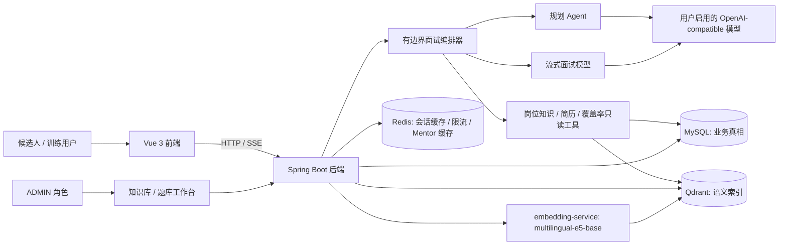
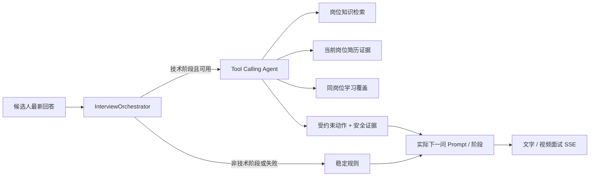
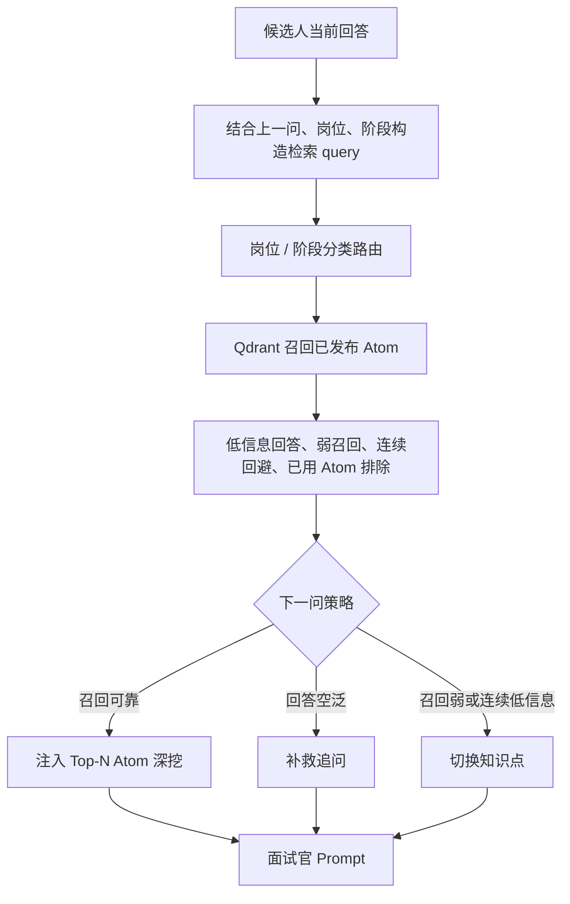

# InterWise AI 模拟面试系统

InterWise 是一个面向技术面试训练的 AI 模拟面试平台。项目把有边界的面试 Agent、简历画像、文字面试、视频面试、数据库题库、动态 RAG 追问、面试复盘和 AI Mentor 打通到同一条学习闭环中，重点解决“只会单轮问答、题库与模拟面试割裂、追问缺少依据、训练结果难以复盘”的问题。

后端基于 `Spring Boot 3 + MyBatis-Plus + LangChain4j + MySQL + Redis + Qdrant`，前端基于 `Vue 3 + Vite + Element Plus`。Docker 部署默认使用独立 `embedding-service` 加载 `intfloat/multilingual-e5-base`，通过 Qdrant 为面试追问提供可重建的语义索引。

## 项目亮点

- 动态面试 RAG：不是传统知识库问答式“用户问题 -> 检索 -> 摘要回答”，而是在每一轮面试中把候选人回答、岗位、阶段、历史已问知识点和题库召回结果转成“下一问决策信号”。
- 有边界的单轮 Agent：技术面每轮可按需调用岗位知识、当前简历和学习覆盖三个只读工具，自主选择深挖、补救、换题、项目追问或阶段切换；工具次数、作用域、输出格式和失败回退均受服务端约束。
- 模拟面试与题库打通：MySQL 保存可审核、可发布、可归档的知识原子，Qdrant 只作为可重建的语义索引；已发布 Atom 才能进入面试追问链路。
- 追问路径更贴近真实面试：技术阶段按岗位和难度召回，结合低信息回答、弱召回、连续回避、已用 Atom 排除等信号，决定补救追问、切换知识点或继续深挖。
- 多模式训练闭环：支持文字面试、视频面试、简历画像、历史报告、AI Mentor 分析和知识覆盖率复盘。
- 内置比赛题库：普通用户默认只使用仓库内置的公共 starter 岗位；题库生产与发布由 `ADMIN` 账号维护，既有私有题库能力和数据保留在功能开关后，比赛 Demo 不对普通用户开放。
- 可评测的 RAG 链路：内置离线检索评测工具链，固定 AI 大模型岗位评测集，支持比较 embedding、候选集大小和 rerank 效果。
- 稳定性与运营观测：内置访问事件、限流、反馈记录、RAG 请求级日志和 Qdrant 失败降级路径。

## 技术栈

### 后端

| 技术 | 版本 / 说明 |
| --- | --- |
| Java | 17 |
| Spring Boot | 3.2.4 |
| MyBatis-Plus | 3.5.5 |
| LangChain4j | 0.29.1 |
| MySQL | 8.0 |
| Redis | 7 |
| Qdrant | 向量检索 |
| Flyway | 9.22.3 |
| PDFBox | 简历 PDF 解析 |
| OpenAI-compatible Chat API | 用户自配 DeepSeek / Kimi / GLM / Qwen / 自定义兼容模型 |
| multilingual-e5-base | Docker 默认 embedding 模型 |

### 前端

| 技术 | 版本 / 说明 |
| --- | --- |
| Vue | 3.5 |
| Vite | 7 |
| Element Plus | 2.13 |
| Axios | HTTP 客户端 |
| ECharts | 图表与词云 |
| face-api.js | 视频面试情绪分析辅助 |
| Web Speech API | 浏览器语音能力 |


### 基础设施

| 组件 | 用途 |
| --- | --- |
| Docker Compose | 本地与云端多容器编排 |
| embedding-service | FastAPI 向量服务 |
| Caddy | 生产 HTTPS 入口 |

## 效果展示

### 工作台与准备流程


### 文字面试与视频面试


### 简历画像、历史报告与 AI Mentor


### 岗位/题库维护


### 偏好设置、大模型配置与题库工作台


## 系统架构



```mermaid
graph LR
    User["候选人 / 训练用户"] --> Frontend["Vue 3 前端"]
    Frontend -->|"HTTP / SSE"| Backend["Spring Boot 后端"]
    Backend --> Orchestrator["有边界面试编排器"]
    Orchestrator --> Planner["规划 Agent"]
    Orchestrator --> Tools["岗位知识 / 简历 / 覆盖率只读工具"]
    Orchestrator --> Generator["流式面试模型"]
    Planner --> LLM["用户启用的 OpenAI-compatible 模型"]
    Generator --> LLM
    Tools --> MySQL
    Tools --> Qdrant
    Backend --> MySQL[("MySQL: 业务真相")]
    Backend --> Redis[("Redis: 会话缓存 / 限流 / Mentor 缓存")]
    Backend --> Qdrant[("Qdrant: 语义索引")]
    Backend --> Embed["embedding-service: multilingual-e5-base"]
    Embed --> Qdrant
    Workspace["知识库 / 题库工作台"] --> Backend
    Admin["ADMIN 角色"] --> Workspace
```

核心边界：

- MySQL 是用户、面试、报告、题库、导入批次和同步状态的业务真相。
- Qdrant 是可重建的向量索引，不直接承载题库发布状态。
- embedding-service 只负责文本向量化，默认输出 768 维 multilingual-e5 向量。
- 前端不直接访问数据库、Redis 或 Qdrant，所有维护动作走后端 API 与用户 ownership / `ADMIN` 角色校验。
- Agent 工具的用户、岗位和记录作用域由后端绑定，模型不能传入任意 ID；失败后同一面试会话回退稳定规则。
- 普通用户题库维护默认关闭，前端隐藏入口只是体验层，后端写权限仍会独立校验。

## 项目结构

```text
.
├── backend/                         # Spring Boot 后端
│   ├── src/main/java/com/interview/
│   │   ├── controller/              # REST API
│   │   ├── service/                 # 面试、简历、Mentor、RAG、题库服务
│   │   │   └── orchestration/       # Agent 契约、只读工具与稳定规则回退
│   │   ├── entity/                  # MySQL 实体
│   │   └── config/                  # LLM、Redis、Embedding、JWT 等配置
│   └── src/main/resources/db/migration/
├── frontend/                        # Vue 3 前端
│   └── src/views/                   # 工作台、准备页、面试页、历史、Mentor、设置
├── embedding-service/               # FastAPI multilingual-e5 向量服务
├── scripts/question_bank_import.py  # 本机题库导入包生成脚本
├── skills/interview-question-bank/  # 本机题库维护 skill
├── docs/adr/                        # 关键架构决策
├── docs/superpowers/                # 重要实现计划与设计记录
├── image                            # 系统架构图与 RAG 流程图
├── docker-compose.example.yml       # 本地 Compose 模板
├── docker-compose.prod.yml          # 生产 Compose
├── CONTEXT.md                       # 领域语言与边界
└── CHANGELOG.md                     # 更新日志
```

## 当前功能

### 基础功能

- 文字面试：SSE 流式生成，按面试阶段推进，支持技术追问、HR 软技能阶段和结束总结。
- 视频面试：摄像头与语音交互入口，结合浏览器能力进行更接近真实场景的训练。
- 面试 Agent：技术阶段先生成受约束的下一问计划，再驱动真实 Prompt 和阶段；页面展示安全决策摘要，异常时不中断整场面试。
- 大模型配置：用户可以在侧边栏配置自己的大模型 Provider，并用加密保存的 API Key 驱动面试、报告和 AI Mentor 等用户侧 LLM 功能。
- 岗位/题库维护：比赛版由管理员维护公共 starter 岗位；普通用户维护能力默认关闭，但原有私有数据和可逆功能开关不会被删除。
- 面试准备：选择岗位、难度、重点方向和简历信息，为后续追问提供上下文。
- 历史报告：保存面试记录、评分、反馈和复盘建议。
- 岗位隔离：现在用户可为不同岗位上传不同简历，并进行针对简历的定制面试。

### 简历与 Mentor

- 简历画像：解析 PDF 简历并生成结构化画像。
- AI Mentor：基于历史面试、知识覆盖率和风险点给出训练建议。
- 知识覆盖：以已发布题库 Atom 为分母，以实际进入面试上下文的 Atom 为分子，避免只统计“看似召回”的候选。

## 有边界 Agent 与动态 RAG

技术面每轮先由 `InterviewOrchestrator` 形成一个可验证计划。规划 Agent 可以调用三个服务端绑定作用域的只读工具，最终只能返回限定动作；动作和证据会进入实际下一问 Prompt。开场、HR、收尾或 Agent 不可用时，系统继续走稳定规则。


```mermaid
flowchart LR
    Answer["候选人最新回答"] --> Orchestrator["InterviewOrchestrator"]
    Orchestrator -->|"技术阶段且可用"| Agent["Tool Calling Agent"]
    Agent --> Knowledge["岗位知识检索"]
    Agent --> Resume["当前岗位简历证据"]
    Agent --> Coverage["同岗位学习覆盖"]
    Agent --> Plan["受约束动作 + 安全证据"]
    Orchestrator -->|"非技术阶段或失败"| Rule["稳定规则"]
    Plan --> Prompt["实际下一问 Prompt / 阶段"]
    Rule --> Prompt
    Prompt --> SSE["文字 / 视频面试 SSE"]
```

单轮工具调用上限为 3。输出必须符合严格 JSON 契约；提前进入 HR 有轮次门槛；超时、Provider 不兼容、工具失败或输出非法时，当前面试会话固定回退规则模式。持久化与前端事件只包含模式、动作、工具名、安全摘要和证据原子 ID，不保存思维链或原始 Provider 错误。详细取舍见 [ADR 0001](docs/adr/0001-bounded-interview-agent.md)。

### 动态 RAG 链路


InterWise 的 RAG 不是独立知识库问答模块，而是嵌入模拟面试流程中的“追问决策层”。


```mermaid
graph TD
    Answer["候选人当前回答"] --> Query["结合上一问、岗位、阶段构造检索 query"]
    Query --> Route["岗位 / 阶段分类路由"]
    Route --> Search["Qdrant 召回已发布 Atom"]
    Search --> Signals["低信息回答、弱召回、连续回避、已用 Atom 排除"]
    Signals --> Decision{"下一问策略"}
    Decision -->|"召回可靠"| Deepen["注入 Top-N Atom 深挖"]
    Decision -->|"回答空泛"| Remedy["补救追问"]
    Decision -->|"召回弱或连续低信息"| Switch["切换知识点"]
    Deepen --> Prompt["面试官 Prompt"]
    Remedy --> Prompt
    Switch --> Prompt
```

召回结果不会直接拼成“参考答案”，而是影响 AI 面试官下一轮追问方式。系统会记录候选 Atom、实际进入上下文的 Atom、零命中、失败原因和检索策略，便于后续人工评测与 rerank 验证。

### 题库与 RAG

- 知识库 / 题库工作台：比赛版仅向 `ADMIN` 账号开放，用于维护公共 starter 岗位、导入结构化 JSON 题库包以及管理知识原子草稿、发布和索引状态。
- 题库导入包生成：项目维护者可在本机使用 `interview-question-bank` skill 或 `scripts/question_bank_import.py` 处理结构化资料，再由管理员在主应用内导入、审查、显式发布和重建索引。
- 同步状态：Qdrant 写入或删除失败会保留可重试状态，不让数据库事务和外部索引状态悄悄分叉。
- 离线评测：`scripts/retrieval_eval` 支持导出、构建候选池、预标注、计算指标和 rerank 对比。
- 内置基础题库：仓库随代码内置可运行公共 starter 题库，覆盖 Java 后端、Web 前端、AI 大模型应用等方向；本地启动会幂等导入 `backend/src/main/resources/knowledge_base/imports/public/**/*.json` 公共导入包并建立 Qdrant 索引。普通用户直接选择这些岗位训练，不需要维护或导入题库。

### 题库维护

仓库内置公共 starter 题库，用于空库首次初始化。比赛 Demo 默认设置 `APP_QUESTION_BANK_USER_MAINTENANCE_ENABLED=false`：普通用户看不到维护入口，后端也拒绝其创建、导入、编辑、发布、归档或重建索引操作；`ADMIN` 账号仍可维护公共题库。

原有私有岗位、私有题库代码和既有数据不删除。未来需要恢复受控开放时，可显式开启该功能开关；不同部署的私有数据仍只保存在各自的 MySQL/Qdrant 中。

## 快速启动(本地部署)

### 环境要求

- Docker Desktop / Docker Compose
- 用户自备 OpenAI-compatible API 账号（如 DeepSeek、Kimi、GLM、Qwen 或自定义兼容供应商）
- SMTP 邮箱授权码（注册、找回密码需要）

裸跑后端、前端或检索评测工具链时，再分别安装 JDK 17、Node.js 20+、Python 3.10+。

### 创建配置

```powershell
Copy-Item .env.example .env
Copy-Item docker-compose.example.yml docker-compose.yml
```

至少修改 `.env` 中的数据库密码、JWT 签名密钥、用户 API Key 加密密钥、统计盐值和 SMTP 邮箱配置：

```env
DB_PASSWORD=your_mysql_password
APP_LLM_CONFIG_ENCRYPTION_KEY=your_base64_or_high_entropy_encryption_key
JWT_SIGN_KEY=your_jwt_signing_key_at_least_32_characters
APP_ANALYTICS_HASH_SALT=your_strong_analytics_hash_salt
MAIL_USERNAME=your_email@qq.com
MAIL_PASSWORD=your_smtp_authorization_code
```

大模型配置说明：

- 项目不提供系统兜底 API Key，也不依赖全局 `DEEPSEEK_API_KEY` 作为普通用户兜底。
- 普通用户若没有有效的启用配置，文字面试、视频面试、报告生成和 AI Mentor 等用户侧 LLM 功能应先引导其到侧边栏“大模型配置”完成配置。
- 当前支持 OpenAI-compatible Provider 预设与自定义兼容端点，文档默认覆盖 DeepSeek、Kimi/Moonshot、GLM/Zhipu、Qwen 和自定义。
- 服务端只需要 `APP_LLM_CONFIG_ENCRYPTION_KEY` 这类加密密钥来加密保存用户 API Key；不要在 `.env`、示例配置、日志或文档里写入任何真实供应商密钥。
- 用户可以保存多个 Provider 配置，但同一时间只能启用一个 active 配置；管理员不能查看用户 API Key 明文。
- 比赛配置默认启用有边界 Agent，并把普通用户题库维护关闭；对应变量见 `.env.example` 的 `APP_INTERVIEW_AGENT_*` 与 `APP_QUESTION_BANK_USER_MAINTENANCE_ENABLED`。

不要提交 `.env`、真实 API Key、JWT Secret、邮箱授权码或数据库密码。

### Docker 部署

```powershell
docker compose up -d --build
```

默认访问：

- 前端：`http://localhost`
- 后端：`http://localhost:8080`
- Qdrant：`http://localhost:6333`
- MySQL：`localhost:13307`
- Redis：`localhost:6379`

首次构建 embedding-service 会下载 PyTorch、sentence-transformers 和 multilingual-e5 模型，耗时取决于网络质量。若切换过 embedding 模型或 Qdrant collection，启动后需要通过知识库 / 题库维护流程重建索引。

### RAG 评测工具

```powershell
python -m pip install -r scripts/retrieval_eval/requirements.txt
python -m scripts.retrieval_eval.validate_dataset --help
python -m scripts.retrieval_eval.calculate_metrics --help
python -m scripts.retrieval_eval.rerank_candidates --help
```

固定评测集位于：

```text
backend/src/test/resources/retrieval-eval/
  ai-model-v1-atoms.jsonl
  ai-model-v1.jsonl
  ai-model-v1-metadata.json
```

原始导出和未审核候选池默认写入 `output/retrieval-eval/`，不提交到 Git。

## 本地开发验证

```powershell
cd backend
mvn test
```

```powershell
cd frontend
npm run build
npx vitest run
```

```powershell
python -m unittest discover -s tests
```

## 相关文档

- [领域上下文](CONTEXT.md)
- [GOAI 比赛 Demo 指南](docs/goai-demo.md)
- [ADR 0001：有边界的单轮面试 Agent](docs/adr/0001-bounded-interview-agent.md)
- [后续优化计划](docs/superpowers/specs/2026-06-13-user-owned-question-bank-rag-report-followups.zh.md)
- [RAG 检索评测设计](docs/superpowers/specs/2026-06-03-rag-retrieval-evaluation-design.md)
- [RAG 链路总结](docs/rag-chain-summary.md)

## 版本

当前稳定版本以 GitHub Releases 为准。更新内容见 [CHANGELOG.md](CHANGELOG.md)。

## 题库来源

内置题库内容来自 mianshiya.com，使用前请按自己的部署、岗位和授权边界复核。

## 贡献说明

欢迎为本项目贡献代码、文档或提出改进建议！你可以通过 Issue 或 Pull Request 参与项目建设。
详见 [贡献指南](docs/贡献指南.md)
