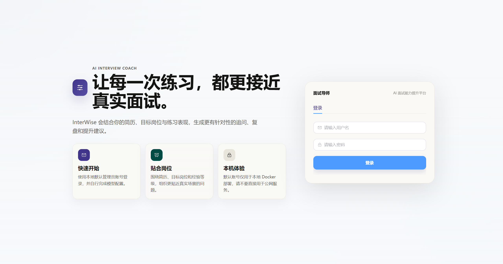
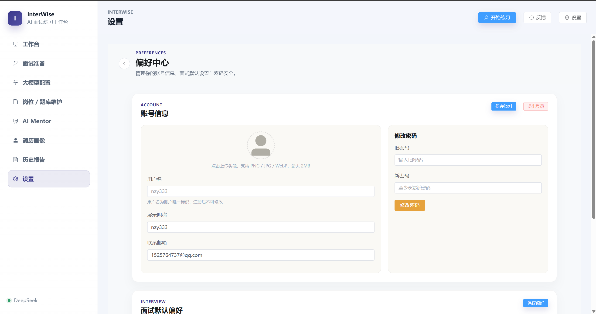
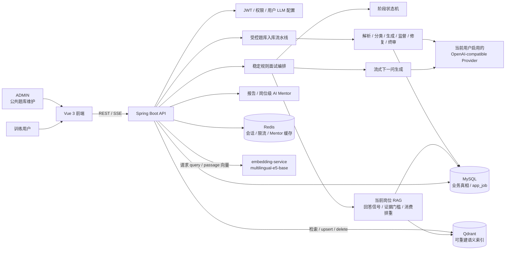
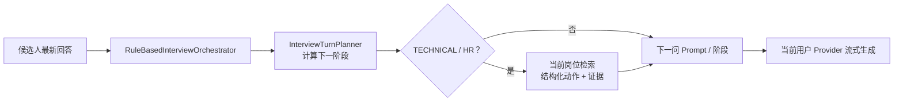
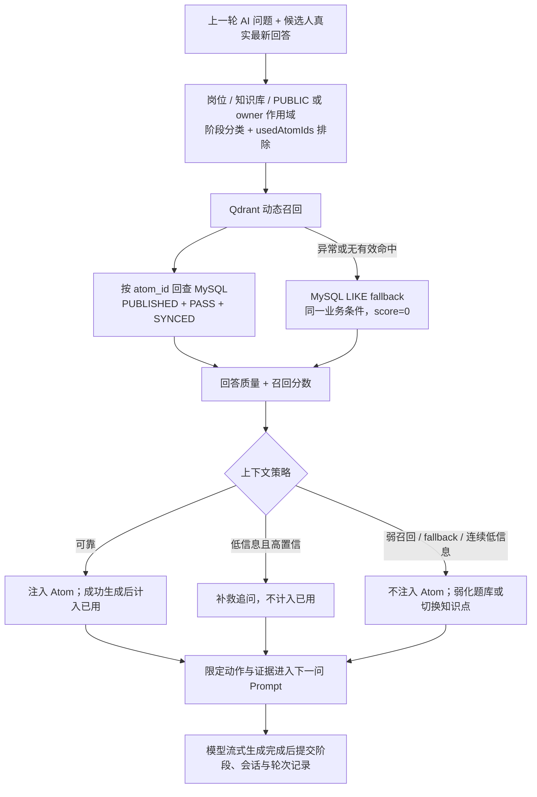

# InterWise AI 模拟面试系统

InterWise 是一个面向技术面试训练的 AI 模拟面试平台。项目把规则驱动的面试流程、简历画像、文字面试、视频面试、数据库题库、动态 RAG 追问、面试复盘和 AI Mentor 打通到同一条学习闭环中，重点解决“只会单轮问答、题库与模拟面试割裂、追问缺少依据、训练结果难以复盘”的问题。

后端基于 `Spring Boot 3 + MyBatis-Plus + LangChain4j + MySQL + Redis + Qdrant`，前端基于 `Vue 3 + Vite + Element Plus`。Docker 部署默认使用独立 `embedding-service` 加载 `intfloat/multilingual-e5-base`，通过 Qdrant 为面试追问提供可重建的语义索引。

## 项目亮点

- 动态面试 RAG：在规则计算出的技术 / HR 阶段检索岗位题库，把候选人真实回答、历史已用知识点和召回结果转成下一问的证据与提示。
- 稳定规则编排：服务端状态机推进阶段，检索规则明确选择自然推进、补救或换题，再由用户启用的模型流式生成下一问。
- 模拟面试与题库打通：MySQL 保存可审核、可发布、可归档的知识原子，Qdrant 只作为可重建的语义索引；只有 `PUBLISHED + PASS + SYNCED` Atom 才能进入面试追问链路。
- 追问路径更贴近真实面试：检索按岗位、知识库及公共 / 私有 owner 作用域隔离，结合低信息回答、弱召回、连续回避、已用 Atom 排除等信号，决定补救追问、切换知识点或继续深挖；难度用于面试 Prompt，不冒充检索过滤条件。
- 多模式训练闭环：支持文字面试、视频面试、简历画像、历史报告、AI Mentor 分析和知识覆盖率复盘。
- 公共与私有题库并存：所有本地账号可使用公共 starter 岗位，也可创建并维护自己的私有岗位 / 题库；`ADMIN` 账号额外负责公共内容发布，私有数据按账号隔离。
- 可评测的 RAG 链路：内置离线检索评测工具链，固定 AI 大模型岗位评测集，支持比较 embedding、候选集大小和 rerank 效果。
- 稳定性与运营观测：内置访问事件、限流、反馈记录、RAG 请求级日志和 Qdrant 失败降级路径。

## 技术栈

### 后端

| 技术 | 版本 / 说明 |
| --- | --- |
| Java | 17 |
| Spring Boot | 3.2.4 |
| MyBatis-Plus | 3.5.5 |
| LangChain4j | 0.29.1 |
| MySQL | 8.0 |
| Redis | 7 |
| Qdrant | 向量检索 |
| Flyway | 9.22.3 |
| PDFBox | 简历 PDF 解析 |
| OpenAI-compatible Chat API | 用户自配 DeepSeek / Kimi / GLM / Qwen / OrcaRouter / 自定义兼容模型 |
| multilingual-e5-base | Docker 默认 embedding 模型 |

### 前端

| 技术 | 版本 / 说明 |
| --- | --- |
| Vue | 3.5 |
| Vite | 7 |
| Element Plus | 2.13 |
| Axios | HTTP 客户端 |
| ECharts | 图表与词云 |
| face-api.js | 视频面试情绪分析辅助 |
| Web Speech API | 浏览器语音能力 |


### 基础设施

| 组件 | 用途 |
| --- | --- |
| Docker Compose | 本地与云端多容器编排 |
| embedding-service | FastAPI 向量服务 |
| Caddy | 生产 HTTPS 入口 |

## 效果展示

### 展示视频

https://github.com/user-attachments/assets/41830c7b-4c01-4444-b8d9-56a6971cf9a1

从登录、面试准备与模拟训练，到动态 RAG 追问、复盘和 AI Mentor，快速了解完整训练闭环。

### 工作台与准备流程




### 文字面试与视频面试


### 简历画像、历史报告与 AI Mentor


### 岗位/题库维护


### 设置与大模型配置




## 系统架构


两张 README 位图的可编辑图源位于 `image/架构图/source/`，修改后可在 Windows 仓库根目录运行 `./scripts/render-readme-diagrams.ps1` 重新生成 PNG。


```mermaid
flowchart LR
    User["训练用户"] --> Web["Vue 3 前端"]
    Admin["ADMIN<br/>公共题库维护"] --> Web
    Web -->|"REST / SSE"| API["Spring Boot API"]

    API --> Auth["JWT / 权限 / 用户 LLM 配置"]
    API --> Orchestrator["稳定规则面试编排"]
    API --> Pipeline["受控题库入库流水线"]
    API --> Review["报告 / 岗位级 AI Mentor"]

    Orchestrator --> Rule["阶段状态机"]
    Orchestrator --> Retrieval["当前岗位 RAG<br/>回答信号 / 证据门槛 / 消费排重"]
    Orchestrator --> Generator["流式下一问生成"]

    Pipeline --> Jobs["解析 / 分类 / 生成 / 监督 / 修复 / 终审"]
    Generator --> LLM["当前用户启用的<br/>OpenAI-compatible Provider"]
    Jobs --> LLM

    API --> MySQL[("MySQL<br/>业务真相 / app_job")]
    API --> Redis[("Redis<br/>会话 / 限流 / Mentor 缓存")]
    Retrieval --> MySQL
    Retrieval --> Qdrant[("Qdrant<br/>可重建语义索引")]
    Jobs --> MySQL
    API -->|"请求 query / passage 向量"| Embed["embedding-service<br/>multilingual-e5-base"]
    API -->|"检索 / upsert / delete"| Qdrant
```

核心边界：

- MySQL 是用户、面试、报告、题库、导入批次和同步状态的业务真相。
- Qdrant 是可重建的向量索引；向量命中仍要回查 MySQL，且 MySQL fallback 使用同一组发布、审核、同步和作用域条件。
- embedding-service 只负责文本向量化，默认输出 768 维 multilingual-e5 向量。
- 面试、报告、AI Mentor 和题库构建都使用执行用户当前启用的 Provider；项目不提供系统兜底 API Key。
- 长任务以 MySQL `app_job` 和本地 `TaskExecutor` 为恢复基础，不引入外部消息队列。

## 项目结构

```text
.
├── backend/                         # Spring Boot 后端
│   ├── src/main/java/com/interview/
│   │   ├── controller/              # REST API
│   │   ├── service/                 # 面试、简历、Mentor、RAG、题库服务
│   │   │   └── orchestration/       # 稳定规则编排与单轮计划
│   │   ├── entity/                  # MySQL 实体
│   │   └── config/                  # LLM、Redis、Embedding、JWT 等配置
│   └── src/main/resources/db/migration/
├── frontend/                        # Vue 3 前端
│   └── src/views/                   # 工作台、准备页、面试页、历史、Mentor、设置
├── embedding-service/               # FastAPI multilingual-e5 向量服务
├── scripts/question_bank_import.py  # 本机题库导入包生成脚本
├── skills/interview-question-bank/  # 本机题库维护 skill
├── docs/adr/                        # 面试与题库流水线架构决策
├── docs/rag-chain-summary.md        # 当前 RAG 链路与实现边界
├── image                            # 系统架构图与 RAG 流程图
├── docker-compose.example.yml       # 本地 Compose 模板
├── docker-compose.prod.yml          # 生产 Compose
├── CONTEXT.md                       # 领域语言与边界
└── CHANGELOG.md                     # 更新日志
```

## 当前功能

### 基础功能

- 文字面试：SSE 流式生成，按面试阶段推进，支持技术追问、HR 软技能阶段和结束总结。
- 视频面试：摄像头与语音交互入口，结合浏览器能力进行更接近真实场景的训练。
- 规则驱动追问：按阶段和回答信号形成下一问计划，保留有作用域的 RAG 证据、补救提示和换题规则。
- 大模型配置：用户可以在侧边栏配置自己的大模型 Provider，并用加密保存的 API Key 驱动面试、报告和 AI Mentor 等用户侧 LLM 功能。
- 岗位/题库维护：本地账号可新增自己的私有岗位并维护私有题库；所有 `ADMIN` 角色拥有一致的公共题库维护能力，同时也能维护各自的私有内容。
- 面试准备：选择岗位、难度、重点方向和简历信息，为后续追问提供上下文。
- 历史报告：保存面试记录、评分、反馈和复盘建议。
- 岗位隔离：现在用户可为不同岗位上传不同简历，并进行针对简历的定制面试。

### 简历与 Mentor

- 简历画像：解析 PDF 简历并生成结构化画像。
- AI Mentor：按当前可见岗位聚合历史面试、知识覆盖率和风险点，独立生成训练建议，避免跨岗位混合诊断。
- 知识覆盖：当前以岗位下 `PUBLISHED` Atom 为分母，以成功生成轮次中实际进入面试上下文的去重 Atom 为分子，避免把“仅召回”误算为已考察；它表示知识暴露 / 考察覆盖，不表示候选人已经掌握。

## 稳定规则与动态 RAG

每轮由唯一的 `RuleBasedInterviewOrchestrator` 形成下一问计划。`InterviewTurnPlanner` 先计算阶段，技术 / HR 阶段再执行题库检索；检索规则依据真实最新回答和召回结果，返回 `CONTINUE_PHASE`、`REMEDIATE` 或 `SWITCH_TOPIC`，并把相应提示与证据交给流式生成模型。


```mermaid
flowchart LR
    Answer["候选人最新回答"] --> Orchestrator["RuleBasedInterviewOrchestrator"]
    Orchestrator --> Phase["InterviewTurnPlanner<br/>计算下一阶段"]
    Phase --> Check{"TECHNICAL / HR？"}
    Check -->|"是"| Knowledge["当前岗位检索<br/>结构化动作 + 证据"]
    Check -->|"否"| Prompt["下一问 Prompt / 阶段"]
    Knowledge --> Prompt
    Prompt --> SSE["当前用户 Provider 流式生成"]
```

阶段由服务端规则推进，动作直接来自结构化检索结果，不再从中文 Prompt 反推。比赛版的 Tool Calling 规划、自动回退、专用配置和页面决策条已移除。新轮次继续保存规则动作和证据，历史记录保留兼容读取。详细取舍见 [ADR 0004](docs/adr/0004-stable-rule-interview.md)。

### 动态 RAG 链路


InterWise 的 RAG 不是独立知识库问答模块，而是嵌入模拟面试流程中的“追问决策层”。


```mermaid
flowchart TD
    RuleQuery["上一轮 AI 问题 + 候选人真实最新回答"] --> Scope["岗位 / 知识库 / PUBLIC 或 owner 作用域<br/>阶段分类 + usedAtomIds 排除"]
    Scope --> Search["Qdrant 动态召回"]
    Search --> Verify["按 atom_id 回查 MySQL<br/>PUBLISHED + PASS + SYNCED"]
    Search -->|"异常或无有效命中"| Fallback["MySQL LIKE fallback<br/>同一业务条件，score=0"]
    Verify --> Signals["回答质量 + 召回分数"]
    Fallback --> Signals
    Signals --> Decision{"上下文策略"}
    Decision -->|"可靠"| Deepen["注入 Atom；成功生成后计入已用"]
    Decision -->|"低信息且高置信"| Remedy["补救追问，不计入已用"]
    Decision -->|"弱召回 / fallback / 连续低信息"| Switch["不注入 Atom；弱化题库或切换知识点"]
    Deepen --> Prompt["限定动作与证据进入下一问 Prompt"]
    Remedy --> Prompt
    Switch --> Prompt
    Prompt --> Log["模型流式生成完成后提交阶段、会话与轮次记录"]
```

召回结果不会直接展示成“参考答案”，而是影响 AI 面试官下一轮追问方式。MySQL fallback 返回的候选分数为 0，只用于降级记录，不会越过分数门槛注入 Prompt。单轮计划分别保存进入 Prompt 的 `evidenceAtomIds` 和用于本场排重的 `consumedAtomIds`：高置信补救可以有证据但不消费。只有模型流式完成后，才提交阶段、历史与会话消费，并保存 `interview_turn` 问答和证据快照，供岗位级覆盖、报告与 AI Mentor 复盘。请求级、候选级日志不能替代已落库轮次；记录保存发生在发送 SSE `done` 之前，不保证浏览器已完整收到问题。

### 题库与 RAG

- 应用内受控构建：私有题库 owner 或公共题库 `ADMIN` 可上传 PDF、DOCX、TXT、Markdown 文档；系统异步完成解析、分类规划、候选生成、独立质量监督和默认最多两轮受限修复，再由用户批次终审并显式发布。
- 审核与发布边界：机器 `AUTO_PASS` 只代表候选可进入终审，不能自动发布；终审先在 MySQL 形成可审计原子，再通过可重试索引步骤同步 Qdrant。普通用户不能维护公共内容，也不能读取其他 owner 的构建工件。
- 本机导入包补充路径：`interview-question-bank` skill 与 `scripts/question_bank_import.py` 可生成带来源证据的结构化 JSON；通用导入只形成 `NEEDS_REVIEW` 草稿，不能绕过人工审核与显式发布。
- 同步状态：Qdrant 写入或删除失败会保留可重试状态，不让数据库事务和外部索引状态悄悄分叉。
- 离线评测：`scripts/retrieval_eval` 支持导出、构建候选池、预标注、计算指标和 rerank 对比。
- 内置基础题库：仓库随代码内置可运行公共 starter 题库，覆盖 Java 后端、Web 前端、AI 大模型应用等方向；本地启动会幂等导入 `backend/src/main/resources/knowledge_base/imports/public/**/*.json` 公共导入包并建立 Qdrant 索引。普通用户直接选择这些岗位训练，不需要维护或导入题库。

### 题库维护

仓库内置公共 starter 题库，用于空库首次初始化。本地 Docker 默认设置 `APP_QUESTION_BANK_USER_MAINTENANCE_ENABLED=true`：每个登录账号都能新增自己的私有岗位，并在自己的知识库中执行受控文档构建、终审发布、查询、归档和重建索引；不能读取或修改其他账号的私有内容。

所有 `ADMIN` 账号遵循同一角色规则：既能维护公共 starter 题库，也能创建和维护各自的私有岗位。生产 Compose 仍默认关闭全部私有题库维护能力，需要上线时再结合租户、配额和存储治理显式评估。

## 快速启动(本地部署)

### 环境要求

- Docker Desktop / Docker Compose
- 用户自备 OpenAI-compatible API 账号（如 DeepSeek、Kimi、GLM、Qwen 或自定义兼容供应商）

裸跑后端、前端或检索评测工具链时，再分别安装 JDK 17、Node.js 20+、Python 3.10+。

### 创建配置

```powershell
Copy-Item .env.example .env
```

至少修改 `.env` 中的数据库用户密码、MySQL root 密码、JWT 签名密钥、用户 API Key 加密密钥和统计盐值：

```env
DB_PASSWORD=your_mysql_password
MYSQL_ROOT_PASSWORD=your_mysql_root_password
APP_LLM_CONFIG_ENCRYPTION_KEY=your_base64_or_high_entropy_encryption_key
JWT_SIGN_KEY=your_jwt_signing_key_at_least_32_characters
APP_ANALYTICS_HASH_SALT=your_strong_analytics_hash_salt
```
可以直接在 PowerShell 生成随机值：

```powershell
[Convert]::ToBase64String([Security.Cryptography.RandomNumberGenerator]::GetBytes(32))
```

### Docker 部署(基础配置完成后)

```powershell
.\scripts\deploy-local.ps1
```

Windows 本地部署统一使用该脚本。脚本会选择 Docker Desktop 的 `desktop-linux` context、校验 Compose、构建失败时利用持久缓存自动重试一次，并在启动后等待前端 API 可用；不要手工设置 `DOCKER_HOST`。

容器全部启动后，打开 `http://localhost`，使用本地默认管理员登录：

```text
用户名：admin
密码：admin123
```

登录后的首次使用顺序：

1. 打开侧边栏“大模型配置”。
2. 选择 DeepSeek、OrcaRouter 或其他兼容 Provider，填写自己的 API Key。
3. 点击“测试连接”，测试成功后保存并启用。
4. 可直接选择内置岗位开始模拟面试，也可进入“岗位 / 题库维护”新增自己的私有岗位并导入题库。

默认访问：

- 前端：`http://localhost`
- 后端：`http://localhost:8080`
- MySQL：`localhost:3307`

Redis 和 Qdrant 默认只对 Compose 内网开放，避免 Windows/WSL 动态端口保留导致本地启动失败。需要从宿主机调试时显式启用调试端口：

```powershell
.\scripts\deploy-local.ps1 -ExposeDataServices
```

此时默认使用 Redis `localhost:16379`、Qdrant `http://localhost:16333`；也可通过 `-RedisHostPort`、`-QdrantHostPort` 指定其他未占用端口。

```powershell
docker --context desktop-linux compose -f docker-compose.example.yml stop
```

首次构建 embedding-service 会下载 PyTorch、sentence-transformers 和 multilingual-e5 模型，耗时取决于网络质量。若切换过 embedding 模型或 Qdrant collection，启动后需要通过知识库 / 题库维护流程重建索引。

Docker Desktop 因系统内存压力异常退出、出现 `dockerInference` stale socket，或 BuildKit 返回 `EOF` 时，不要执行 factory reset。先退出占用大量内存的程序并重启 Docker Desktop，再重新运行部署脚本；后端 Maven 下载缓存会跨失败保留。详细处置见 [本地 Docker 部署与故障恢复](docs/local-docker-deployment.md)。

大模型配置说明：

- 项目不提供系统兜底 API Key，也不依赖全局 `DEEPSEEK_API_KEY` 作为普通用户兜底。
- 默认管理员首次登录后，需要进入侧边栏“大模型配置”，新建 DeepSeek 或其他兼容 Provider，填写自己的 API Key，测试连接并启用该配置。
- 没有有效的启用配置时，文字面试、视频面试、报告生成和 AI Mentor 等用户侧 LLM 功能会引导用户先完成配置。
- 当前支持 OpenAI-compatible Provider 预设与自定义兼容端点，文档默认覆盖 DeepSeek、Kimi/Moonshot、GLM/Zhipu、Qwen、OrcaRouter 和自定义。
- 用户可以保存多个 Provider 配置，但同一时间只能启用一个 active 配置。

OrcaRouter 配置：

1. 通过[项目推广链接注册或登录 OrcaRouter](https://www.orcarouter.ai/ref/ref_ab37f4dab3512456458e)，在控制台创建 API Key。
2. 在“大模型配置”中选择 OrcaRouter，填写 API Key；Base URL 默认为 `https://api.orcarouter.ai/v1`。
3. 默认模型为免费路由 `orcarouter/free`。当前免费选项还包括 `qwen/qwen3.8-27b-free`、`tencent/hy3-free` 和 `deepseek/deepseek-v4-flash-free`；具体可用模型以 OrcaRouter 控制台为准。

## 本地开发验证

```powershell
cd backend
mvn test
```

```powershell
cd frontend
npm run build
npx vitest run
```

```powershell
python -m unittest discover -s tests
```

## 相关文档

- [领域上下文](CONTEXT.md)
- [ADR 0004：采用稳定规则面试主线](docs/adr/0004-stable-rule-interview.md)
- [ADR 0001：有边界的单轮面试 Agent（已取代）](docs/adr/0001-bounded-interview-agent.md)
- [ADR 0002：应用内受控题库构建](docs/adr/0002-in-app-question-bank-build-agent.md)
- [ADR 0003：受控文档入库流水线](docs/adr/0003-controlled-question-bank-ingestion-pipeline.md)
- [RAG 链路总结](docs/rag-chain-summary.md)

## 版本

最新正式发布为 [`v1.5.0`](https://github.com/nzy0510/AI-Interview/releases/tag/v1.5.0)；后续以 [GitHub Releases](https://github.com/nzy0510/AI-Interview/releases) 和 [CHANGELOG.md](CHANGELOG.md) 为准。

## 题库来源

内置题库内容来自 mianshiya.com，使用前请按自己的部署、岗位和授权边界复核。

## 贡献说明

欢迎为本项目贡献代码、文档或提出改进建议！你可以通过 Issue 或 Pull Request 参与项目建设。
详见 [贡献指南](docs/贡献指南.md)
