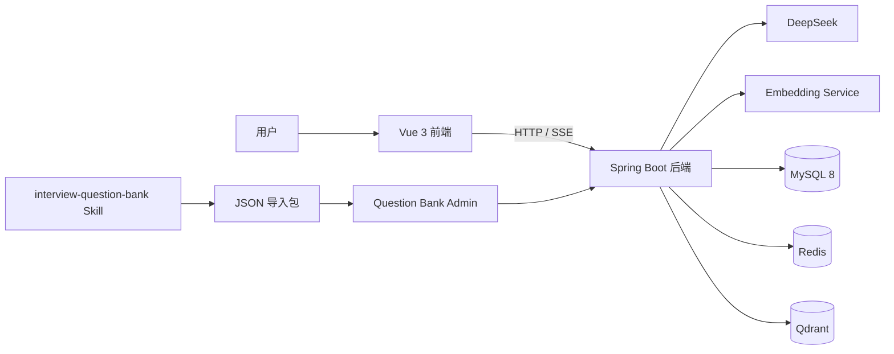
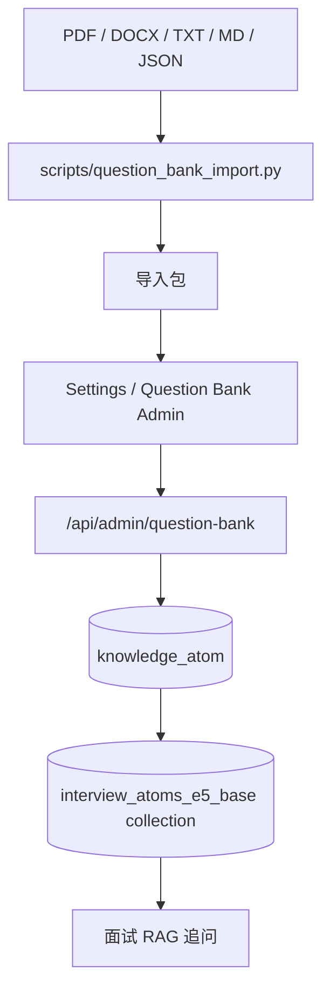

# InterWise AI 模拟面试系统

InterWise 是一个面向技术面试训练的 AI 模拟面试平台。项目采用 `Spring Boot 3 + MyBatis-Plus + LangChain4j + DeepSeek + Redis + MySQL 8 + Qdrant` 构建后端，前端使用 `Vue 3 + Vite + Element Plus`。系统支持文字面试、视频面试、简历画像、RAG 追问、面试复盘、AI Mentor 与数据库题库维护。


## 核心能力

- 文字 / 视频双模式面试：支持 SSE 流式回答、语音识别、语音播报、摄像头情绪分析。
- 多角色面试流程：基于 `InterviewPhase` 状态机在开场、技术、HR、收尾和结束阶段流转，完整面试会进入独立 HR 软技能专项阶段。
- 岗位化追问：技术阶段结合岗位、难度、重点能力、简历画像和题库检索生成追问；支持 Java、前端和 AI 大模型岗位，HR 阶段独立使用 `HR软技能` 题库分类。
- 数据库题库：知识原子落入 MySQL，发布后的题目同步到 Qdrant，供面试 RAG 检索。
- 题库维护 Skill：`skills/interview-question-bank` 支持从 PDF、DOCX、TXT、MD、JSON 生成导入包，由开发者管理面板校验和发布。
- 简历画像：PDF 简历解析后写入 `resume_profile`，前端以服务端状态为准，避免旧浏览器缓存误用。
- AI Mentor：聚合面试历史、知识覆盖、风险提醒和行动建议，Redis 缓存 24 小时并支持刷新。
- 访问统计与成本保护：记录页面访问、关键行为、反馈、异常和限流命中；使用 Redis + MySQL 快照限制每日 AI 面试、对话、简历解析和 Mentor 生成额度。
- Docker 本地启动：`frontend + backend + embedding-service + mysql + redis + qdrant` 一键编排。

## 技术栈

### 后端

- Java 17
- Spring Boot 3.2.4
- MyBatis-Plus 3.5.5
- LangChain4j 0.29.1
- DeepSeek API
- AllMiniLmL6V2 Embedding Model（本地 Java 默认）
- multilingual-e5-base Embedding Service（Docker 默认）
- MySQL 8.0
- Redis 7
- Qdrant
- Flyway 9.22.3
- Apache PDFBox
- Fastjson2
- JJWT

### 前端

- Vue 3.5
- Vite 7
- Element Plus
- Axios
- ECharts / echarts-wordcloud
- face-api.js
- Web Speech API

## 架构概览


```mermaid
graph LR
    User["用户"] --> Frontend["Vue 3 前端"]
    Frontend -->|"HTTP / SSE"| Backend["Spring Boot 后端"]
    Backend --> LLM["DeepSeek"]
    Backend --> Embedding["Embedding Service"]
    Backend --> MySQL[("MySQL 8")]
    Backend --> Redis[("Redis")]
    Backend --> Qdrant[("Qdrant")]
    Skill["interview-question-bank Skill"] --> Package["JSON 导入包"]
    Package --> Admin["Question Bank Admin"]
    Admin --> Backend
```

配套架构图可直接在 GitHub 中预览：

- [InterWise 系统架构图](image/架构图/InterWise-系统架构图.png)
- [InterWise RAG 流程图](image/架构图/InterWise-RAG流程图.png)

架构语言与关键决策：

- [领域上下文与术语](CONTEXT.md)
- [ADR 0002：题库导入生命周期](docs/adr/0002-question-bank-import-lifecycle.md)
- [ADR 0004：移除 MCP 功能](docs/adr/0004-remove-mcp-feature.md)

## 主要目录

```text
.
├── CONTEXT.md                      # InterWise 根级领域语言与边界
├── backend/
│   ├── src/main/java/com/interview/
│   │   ├── config/                 # LLM、Redis、Prompt、岗位分类、JWT 配置
│   │   ├── controller/             # REST API 与题库维护接口
│   │   ├── dto/                    # 请求 / 响应 DTO
│   │   ├── entity/                 # MySQL 实体与 InterviewPhase
│   │   ├── mapper/                 # MyBatis-Plus Mapper
│   │   ├── service/                # 面试、简历、Mentor、RAG、题库服务
│   │   └── utils/                  # JwtUtils 等工具
│   └── src/main/resources/
│       ├── db/migration/           # Flyway 迁移
│       └── knowledge_base/atoms/   # 旧 JSON 题库种子，启动时可导入数据库
├── frontend/
│   └── src/
│       ├── views/                  # 首页、面试、视频面试、简历、历史、Mentor、设置
│       ├── components/             # dashboard、layout 等组件
│       ├── api/                    # Axios API 封装
│       └── utils/                  # auth、request、interviewEntry
├── mysql/init/init.sql             # Docker 首次初始化脚本
├── scripts/
│   ├── question_bank_import.py     # PDF/DOCX/TXT/MD/JSON -> 题库导入包
│   ├── atomizer.py                 # 旧知识原子生成脚本
│   └── reclassify_hot200.py        # 旧题库分类整理脚本
├── embedding-service/              # Docker 默认使用的 multilingual-e5-base HTTP 向量服务
├── skills/interview-question-bank/ # Codex 题库维护 Skill
├── docs/adr/                       # 架构决策记录
├── image/架构图/                   # 系统架构图与 RAG 流程图 PNG
├── docker-compose.example.yml      # 本地 Docker Compose 模板
├── docker-compose.prod.yml         # 生产部署模板
├── .env.example                    # 环境变量模板
└── README.md
```

## 快速启动

### 1. 准备环境

- Docker Desktop / Docker Compose
- 可用的 DeepSeek API Key
- 如需注册和找回密码，准备 SMTP 邮箱授权码

### 2. 创建配置文件

```powershell
Copy-Item .env.example .env
Copy-Item docker-compose.example.yml docker-compose.yml
```

至少补齐：

```env
DB_PASSWORD=your_mysql_password
DEEPSEEK_API_KEY=your_deepseek_api_key
JWT_SIGN_KEY=your_jwt_signing_key_at_least_32_characters
APP_ADMIN_TOKEN=your_strong_ops_admin_token
APP_ANALYTICS_HASH_SALT=your_strong_analytics_hash_salt
MAIL_USERNAME=your_email@qq.com
MAIL_PASSWORD=your_smtp_authorization_code
```

`APP_ADMIN_TOKEN` 用于前端 Operations 统计页、管理反馈接口与题库管理面板；不要把真实值写入代码或提交到 Git。

### 3. 启动

```powershell
docker compose up -d --build
```

默认访问：

- 前端：`http://localhost`
- 后端：`http://localhost:8080`
- MySQL：`localhost:13307`
- Redis：`localhost:6379`
- Qdrant：`http://localhost:6333`

如果 Windows 提示端口不可用，优先检查 Docker Desktop 是否已启动，以及本机端口是否被占用或被系统排除。

## 数据库与迁移

项目以 MySQL 8.0 为当前标准数据库版本。首次启动时：

1. `mysql/init/init.sql` 创建基础表。
2. Flyway 自动执行 `backend/src/main/resources/db/migration` 下的版本迁移。
3. `V6__add_question_bank.sql` 创建题库相关表。
4. `V7__add_analytics_rate_limit_tables.sql` 创建访问事件、每日额度和反馈表。
5. `V12__track_rag_context_selection.sql` 标记候选 Atom 是否实际进入面试上下文。
6. 当 `QUESTION_BANK_SEED_FROM_JSON=true` 且题库为空时，后端会从 `knowledge_base/atoms/**/*.json` 导入题库种子。

当前题库导入逻辑会跳过旧 JSON 中重复的 `atom_id`，唯一题目发布后会同步到 Qdrant。
该启动种子仅用于首次安装空库初始化，是 Developer Admin Console 发布约束的安装期例外；日常新增、修改、发布和归档仍必须通过管理面板完成。

## 题库与 Qdrant

### 题库数据流


```mermaid
graph TD
    Source["PDF / DOCX / TXT / MD / JSON"] --> Script["scripts/question_bank_import.py"]
    Script --> Package["导入包"]
    Package --> Admin["Settings / Question Bank Admin"]
    Admin --> API["/api/admin/question-bank"]
    API --> MySQL[("knowledge_atom")]
    MySQL --> Qdrant[("interview_atoms_e5_base collection")]
    Qdrant --> Interview["面试 RAG 追问"]
```

### 维护入口

题库写入只通过开发者可见的 `Settings -> Question Bank Admin` 面板进行。开发者输入 `APP_ADMIN_TOKEN` 后，可上传生成的 JSON 导入包、校验、试运行、正式发布、查询与维护索引；脚本和 Skill 不直接写入数据库或调用发布接口。

### RAG 检索日志

面试题库检索会记录两层日志：

- `rag_retrieval_request_log`：每次检索请求一行，包含零命中、跳过和失败请求，用于分析召回覆盖、检索策略与延迟。
- `rag_retrieval_log`：每个候选知识原子一行，通过 `request_id` 关联请求级日志；`context_selected=true` 表示该 Atom 实际进入 Top-10 提示词上下文。

`query_text` 可能包含候选人回答内容，只允许受限访问；导出检索评测集前必须脱敏，不能把用户 ID、记录 ID、完整原始面试记录或其他个人信息提交到 Git。

`InterviewRetrievalService` 统一负责上一轮问题与当前回答的 query 构造、阶段分类路由、Top-20 候选检索、日志和 Top-10 上下文选择。只有模型成功完成当前轮后，Top-10 Atom 才会记为已使用；失败流不会消耗候选，同一面试记录也不会并发启动两轮。

### RAG Embedding 与候选集

Docker 部署默认使用 `embedding-service` 加载 `intfloat/multilingual-e5-base`，后端通过 HTTP 调用该服务生成向量。普通本地 Java 运行仍默认使用内置 `all-minilm`，便于不启动 Python 模型服务时调试。

关键配置：

```env
APP_EMBEDDING_PROVIDER=http
APP_EMBEDDING_ENDPOINT=http://embedding-service:8000/embed
APP_EMBEDDING_QUERY_PREFIX=query:
APP_EMBEDDING_PASSAGE_PREFIX=passage:
APP_EMBEDDING_CONNECT_TIMEOUT_MS=3000
APP_EMBEDDING_READ_TIMEOUT_MS=10000
QDRANT_COLLECTION=interview_atoms_e5_base
QDRANT_VECTOR_SIZE=768
QDRANT_CONNECT_TIMEOUT_MS=3000
QDRANT_READ_TIMEOUT_MS=5000
APP_RAG_RETRIEVAL_LIMIT=20
APP_RAG_CONTEXT_LIMIT=10
```

`multilingual-e5-base` 使用 768 维向量，不能写入旧的 384 维 `interview_atoms` collection。后端会校验已有 collection 的维度，不匹配时拒绝使用并记录降级检索。切换模型时使用新的 Qdrant collection 名称，并在服务启动后执行一次题库全量 reindex。

生产环境当前默认约定：

- `QDRANT_COLLECTION=interview_atoms_e5_base`
- `QDRANT_VECTOR_SIZE=768`
- Qdrant points 数量应与已发布题库原子数量一致。
- 切换 `APP_EMBEDDING_PROVIDER`、`QDRANT_COLLECTION` 或 `QDRANT_VECTOR_SIZE` 后，需要通过开发者题库管理面板执行全量 reindex，并确认失败数为 0。
- 发布失败使用 `FAILED` 状态重试；归档删除失败使用 `DELETE_FAILED` 状态，未同步重建会同时补偿 Qdrant 写入与删除。

### RAG 离线检索评测

`scripts/retrieval_eval` 提供 AI 大模型岗位的离线检索评测工具链，用于比较候选集大小、中文或多语言 Embedding 模型，以及后续 rerank 的潜在价值。该流程只读 MySQL，并在本地加载模型计算相似度，不会修改生产 Qdrant collection。

固定评测数据提交到：

```text
backend/src/test/resources/retrieval-eval/
  ai-model-v1-atoms.jsonl
  ai-model-v1.jsonl
  ai-model-v1-metadata.json
```

v1 Atom 快照和 100 条 query 数据集一旦审核提交即保持不可变。原始导出、未审核 query、候选池、模型建议和报告写入 `output/retrieval-eval/`，默认不提交到 Git。

安装可选依赖：

```powershell
python -m pip install -r scripts/retrieval_eval/requirements.txt
```

配置只读数据库账号：

```env
RETRIEVAL_EVAL_DB_HOST=localhost
RETRIEVAL_EVAL_DB_PORT=3306
RETRIEVAL_EVAL_DB_USER=readonly_user
RETRIEVAL_EVAL_DB_PASSWORD=replace_me
RETRIEVAL_EVAL_DB_NAME=interview_db
```

典型流程：

```powershell
python scripts/retrieval_eval/export_atoms.py --output output/retrieval-eval/ai-model-atoms.jsonl
python scripts/retrieval_eval/extract_real_queries.py --limit 40 --output output/retrieval-eval/real-queries.jsonl
```

人工检查真实 query 的脱敏结果并填写 `scenario` 后，再生成补齐 query：

```powershell
python scripts/retrieval_eval/generate_synthetic_queries.py `
  --real-queries output/retrieval-eval/real-queries.jsonl `
  --atoms output/retrieval-eval/ai-model-atoms.jsonl `
  --output output/retrieval-eval/ai-model-v1-unjudged.jsonl
```

评分、候选池和模型预标注：

```powershell
python scripts/retrieval_eval/score_embeddings.py `
  --queries output/retrieval-eval/ai-model-v1-unjudged.jsonl `
  --atoms output/retrieval-eval/ai-model-atoms.jsonl `
  --output output/retrieval-eval/embedding-rankings.jsonl `
  --top-k 30

python scripts/retrieval_eval/build_candidate_pool.py `
  --queries output/retrieval-eval/ai-model-v1-unjudged.jsonl `
  --atoms output/retrieval-eval/ai-model-atoms.jsonl `
  --rankings output/retrieval-eval/embedding-rankings.jsonl `
  --output output/retrieval-eval/candidate-pool.jsonl

python scripts/retrieval_eval/prelabel_candidates.py `
  --queries output/retrieval-eval/ai-model-v1-unjudged.jsonl `
  --atoms output/retrieval-eval/ai-model-atoms.jsonl `
  --pool output/retrieval-eval/candidate-pool.jsonl `
  --output output/retrieval-eval/candidate-pool-prelabeled.jsonl
```

模型建议不是评测真值。人工审核 Atom 快照、query 和 `0-3` relevance judgment 后，才能写入固定 v1 数据集。验证和生成报告：

```powershell
python scripts/retrieval_eval/validate_dataset.py `
  --dataset backend/src/test/resources/retrieval-eval/ai-model-v1.jsonl `
  --metadata backend/src/test/resources/retrieval-eval/ai-model-v1-metadata.json `
  --atoms backend/src/test/resources/retrieval-eval/ai-model-v1-atoms.jsonl

python scripts/retrieval_eval/score_embeddings.py `
  --queries backend/src/test/resources/retrieval-eval/ai-model-v1.jsonl `
  --atoms backend/src/test/resources/retrieval-eval/ai-model-v1-atoms.jsonl `
  --output output/retrieval-eval/embedding-rankings.jsonl `
  --top-k 30

python scripts/retrieval_eval/calculate_metrics.py `
  --dataset backend/src/test/resources/retrieval-eval/ai-model-v1.jsonl `
  --rankings output/retrieval-eval/embedding-rankings.jsonl `
  --metrics-output output/retrieval-eval/ai-model-v1-metrics.json `
  --report-output output/retrieval-eval/ai-model-v1-report.md `
  --seed 20260603
```

## 题库维护 Skill

仓库内置 Skill：

```text
skills/interview-question-bank/
```

它的定位是给开发者维护私有题库使用，而不是给普通用户开放后台。典型流程：

1. 准备 PDF、DOCX、TXT、MD 或 JSON 资料。
2. 使用 `scripts/question_bank_import.py` 生成导入包。
3. 按需评审导入包。
4. 登录开发者账号，打开 `Settings -> Question Bank Admin` 并输入 `APP_ADMIN_TOKEN`。
5. 上传导入包，先校验与试运行，再明确发布并在面板中验证索引和检索结果。

HR 软技能题库应使用 `HR软技能` 分类，先生成 `DRAFT` 导入包并在管理面板校验；人工确认后再发布并按需重建索引。

AI 大模型岗位使用 `AI大模型` 题库分类；导入包发布后，`AI大模型` 和 `大模型` 岗位关键字都会路由到该分类。

示例：

```powershell
python scripts/question_bank_import.py --input .\materials\redis.pdf --category redis --mode DRAFT
```

默认导入包文件名为 `question_bank_imports/qb-<category>-<mode>-<YYYYMMDD-HHMMSS>-<shortid>.json`，例如 `qb-redis-draft-20260601-205707-e7d1a9.json`；需要指定文件名时使用 `--output`。

生成后，使用网页管理面板完成导入与发布，不再存在脚本直提或外部 MCP 入口。

## 本地开发

### 后端

```powershell
cd backend
mvn spring-boot:run
```

本地后端需要配置：

- MySQL 8.0
- Redis
- Qdrant
- DeepSeek API Key
- JWT 签名密钥
- 可选 SMTP 邮箱

### 前端

```powershell
cd frontend
npm install
npm run dev
```

前端通过 `VITE_API_BASE_URL` 指向后端，默认可使用 `.env.example` 中的 `http://localhost:8080`。

## 验证命令

后端测试：

```powershell
cd backend
mvn test
```

前端构建：

```powershell
cd frontend
npm run build
```

前端单测：

```powershell
cd frontend
npm exec vitest -- --run
```

当前项目在 Windows 环境中偶尔会遇到 Vitest / esbuild `spawn EPERM`，通常提升权限重跑即可。

## 访问统计、限流与每日额度

生产默认开启接口限流和每日 AI 成本额度：

- 登录、注册、验证码、重置密码、开始面试、AI 对话、报告生成、简历解析、Mentor 刷新和反馈提交都会按 IP 或用户维度限流。
- 每个登录用户默认每日额度：开始面试 5 次、AI 对话 80 轮、简历解析 3 次、AI Mentor 生成 3 次。
- 超限统一返回 `429` 和友好提示，例如“今日 AI 对话额度已用完，请明天再试”。
- 页面访问、登录注册、面试开始/结束、报告查看、反馈、异常和限流命中会写入 `app_event_log`。
- 额度使用会同步到 `user_daily_usage`，反馈写入 `user_feedback`。

相关环境变量：

```env
APP_ADMIN_TOKEN=replace_with_a_strong_admin_analytics_token
APP_ANALYTICS_HASH_SALT=replace_with_a_long_random_analytics_hash_salt
APP_RATE_LIMIT_ENABLED=true
APP_QUOTA_ENABLED=true
APP_DAILY_INTERVIEW_LIMIT=5
APP_DAILY_AI_CHAT_TURN_LIMIT=80
APP_DAILY_RESUME_PARSE_LIMIT=3
APP_DAILY_MENTOR_GENERATE_LIMIT=3
```

登录后访问 `/admin/analytics`，输入 `APP_ADMIN_TOKEN` 可查看 PV、UV、注册、登录、面试完成率、限流命中、今日额度使用和最新反馈。

## Azure 云端服务器部署
- 该项目已完成 Azure 云端部署，当前内测地址为 https://interwise.japaneast.cloudapp.azure.com
