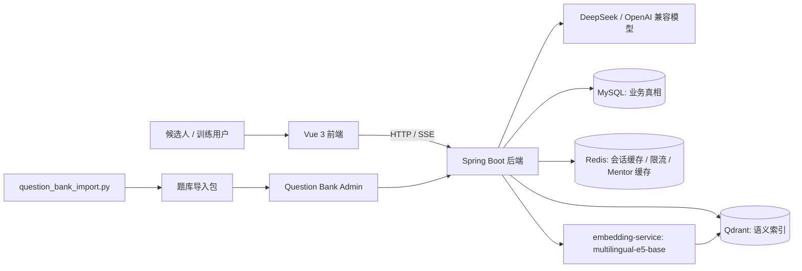
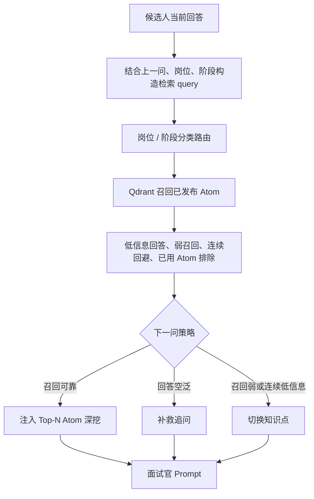

# InterWise AI 模拟面试系统

InterWise 是一个面向技术面试训练的 AI 模拟面试平台。项目把简历画像、文字面试、视频面试、数据库题库、动态 RAG 追问、面试复盘和 AI Mentor 打通到同一条学习闭环中，重点解决“只会单轮问答、题库与模拟面试割裂、追问缺少依据、训练结果难以复盘”的问题。

后端基于 `Spring Boot 3 + MyBatis-Plus + LangChain4j + MySQL + Redis + Qdrant`，前端基于 `Vue 3 + Vite + Element Plus`。Docker 部署默认使用独立 `embedding-service` 加载 `intfloat/multilingual-e5-base`，通过 Qdrant 为面试追问提供可重建的语义索引。

## 项目亮点

- 动态面试 RAG：不是传统知识库问答式“用户问题 -> 检索 -> 摘要回答”，而是在每一轮面试中把候选人回答、岗位、阶段、历史已问知识点和题库召回结果转成“下一问决策信号”。
- 模拟面试与题库打通：MySQL 保存可审核、可发布、可归档的知识原子，Qdrant 只作为可重建的语义索引；已发布 Atom 才能进入面试追问链路。
- 追问路径更贴近真实面试：技术阶段按岗位和难度召回，结合低信息回答、弱召回、连续回避、已用 Atom 排除等信号，决定补救追问、切换知识点或继续深挖。
- 多模式训练闭环：支持文字面试、视频面试、简历画像、历史报告、AI Mentor 分析和知识覆盖率复盘。
- 题库工程化运维：提供开发者可见的 Question Bank Admin，支持导入包校验、试运行、发布、归档、恢复、搜索预览、增量/全量 reindex。
- 可评测的 RAG 链路：内置离线检索评测工具链，固定 AI 大模型岗位评测集，支持比较 embedding、候选集大小和 rerank 效果。
- 成本与稳定性保护：内置访问事件、每日额度、限流、反馈记录、RAG 请求级日志和 Qdrant 失败降级路径。

## 效果展示

### 工作台与准备流程


### 文字面试与视频面试


### 简历画像、历史报告与 AI Mentor


### 偏好设置与题库运维入口


## 系统架构



```mermaid
graph LR
    User["候选人 / 训练用户"] --> Frontend["Vue 3 前端"]
    Frontend -->|"HTTP / SSE"| Backend["Spring Boot 后端"]
    Backend --> LLM["DeepSeek / OpenAI 兼容模型"]
    Backend --> MySQL[("MySQL: 业务真相")]
    Backend --> Redis[("Redis: 会话缓存 / 限流 / Mentor 缓存")]
    Backend --> Qdrant[("Qdrant: 语义索引")]
    Backend --> Embed["embedding-service: multilingual-e5-base"]
    Embed --> Qdrant
    Admin["Question Bank Admin"] --> Backend
    Script["question_bank_import.py"] --> Package["题库导入包"]
    Package --> Admin
```

核心边界：

- MySQL 是用户、面试、报告、题库、导入批次和同步状态的业务真相。
- Qdrant 是可重建的向量索引，不直接承载题库发布状态。
- embedding-service 只负责文本向量化，默认输出 768 维 multilingual-e5 向量。
- 前端不直接访问数据库、Redis 或 Qdrant，所有维护动作走后端 API 与管理校验。

## 动态 RAG 链路


InterWise 的 RAG 不是独立知识库问答模块，而是嵌入模拟面试流程中的“追问决策层”。


```mermaid
graph TD
    Answer["候选人当前回答"] --> Query["结合上一问、岗位、阶段构造检索 query"]
    Query --> Route["岗位 / 阶段分类路由"]
    Route --> Search["Qdrant 召回已发布 Atom"]
    Search --> Signals["低信息回答、弱召回、连续回避、已用 Atom 排除"]
    Signals --> Decision{"下一问策略"}
    Decision -->|"召回可靠"| Deepen["注入 Top-N Atom 深挖"]
    Decision -->|"回答空泛"| Remedy["补救追问"]
    Decision -->|"召回弱或连续低信息"| Switch["切换知识点"]
    Deepen --> Prompt["面试官 Prompt"]
    Remedy --> Prompt
    Switch --> Prompt
```

默认策略：

- `APP_RAG_RETRIEVAL_LIMIT=20`：默认召回候选集。
- `APP_RAG_RETRIEVAL_LIMIT_MAX=30`：短技术回答或多技术点混杂时可动态扩展。
- `APP_RAG_CONTEXT_LIMIT=10`：最终进入提示词的上下文 Atom 上限。
- `APP_RAG_HIGH_CONFIDENCE_SCORE=0.70`：高置信召回阈值。
- `APP_RAG_MIN_CONTEXT_SCORE=0.55`：低于该分数不注入题库上下文。

这一设计和传统 RAG 的差异在于：召回结果不直接拼成答案，而是影响 AI 面试官下一轮追问方式；系统还会记录候选 Atom、实际进入上下文的 Atom、零命中、失败原因和检索策略，便于后续人工评测与 rerank 验证。

## 当前功能

### 面试训练

- 文字面试：SSE 流式生成，按面试阶段推进，支持技术追问、HR 软技能阶段和结束总结。
- 视频面试：摄像头与语音交互入口，结合浏览器能力进行更接近真实场景的训练。
- 面试准备：选择岗位、难度、重点方向和简历信息，为后续追问提供上下文。
- 历史报告：保存面试记录、评分、反馈和复盘建议。

### 简历与 Mentor

- 简历画像：解析 PDF 简历并生成结构化画像。
- AI Mentor：基于历史面试、知识覆盖率和风险点给出训练建议。
- 知识覆盖：以已发布题库 Atom 为分母，以实际进入面试上下文的 Atom 为分子，避免只统计“看似召回”的候选。

### 题库与 RAG 运维

- 题库导入包：`scripts/question_bank_import.py` 将 PDF、DOCX、TXT、MD、JSON 转为可审核 JSON 包。
- 管理面板：Settings 中的 Question Bank Admin 支持校验、试运行、发布、归档、恢复、搜索和 reindex。
- 同步状态：Qdrant 写入或删除失败会保留可重试状态，不让数据库事务和外部索引状态悄悄分叉。
- 离线评测：`scripts/retrieval_eval` 支持导出、构建候选池、预标注、计算指标和 rerank 对比。
- 内置基础题库：仓库仅随代码内置基础可运行题库，覆盖 Java 后端、前端、消息队列、HR 通用能力与 AI 大模型等核心方向；本地首次空库启动会自动导入 `backend/src/main/resources/knowledge_base/atoms/**/*.json` 并建立 Qdrant 索引。云端私有扩展题库、临时导入包和运维数据不会自动同步到他人本地部署，需要开发者通过 Question Bank Admin 单独导入、发布和 reindex。

### 运营保护

- 访问统计：记录页面访问、关键行为、异常、反馈和限流命中。
- 每日额度：限制 AI 面试、AI Chat、简历解析和 Mentor 生成次数。
- 开发者豁免：支持按用户 ID、用户名或邮箱配置开发者白名单。
- 健康检查：`/api/health` 汇总应用、MySQL、Redis、Qdrant 状态。

## 技术栈

### 后端

| 技术 | 版本 / 说明 |
| --- | --- |
| Java | 17 |
| Spring Boot | 3.2.4 |
| MyBatis-Plus | 3.5.5 |
| LangChain4j | 0.29.1 |
| MySQL | 8.0 |
| Redis | 7 |
| Qdrant | 向量检索 |
| Flyway | 9.22.3 |
| PDFBox | 简历 PDF 解析 |
| DeepSeek API | OpenAI 兼容聊天模型 |
| multilingual-e5-base | Docker 默认 embedding 模型 |

### 前端

| 技术 | 版本 / 说明 |
| --- | --- |
| Vue | 3.5 |
| Vite | 7 |
| Element Plus | 2.13 |
| Axios | HTTP 客户端 |
| ECharts | 图表与词云 |
| face-api.js | 视频面试情绪分析辅助 |
| Web Speech API | 浏览器语音能力 |

### 基础设施

| 组件 | 用途 |
| --- | --- |
| Docker Compose | 本地与云端多容器编排 |
| embedding-service | FastAPI 向量服务 |
| Caddy | 生产 HTTPS 入口 |
| Azure VM | 当前云端部署形态 |

## 快速启动

### 环境要求

- Docker Desktop / Docker Compose
- JDK 17
- Node.js 20+
- Python 3.10+（仅运行题库脚本或检索评测时需要）
- DeepSeek API Key
- SMTP 邮箱授权码（注册、找回密码需要）

### 创建配置

```powershell
Copy-Item .env.example .env
Copy-Item docker-compose.example.yml docker-compose.yml
```

至少配置：

```env
DB_PASSWORD=your_mysql_password
DEEPSEEK_API_KEY=your_deepseek_api_key
JWT_SIGN_KEY=your_jwt_signing_key_at_least_32_characters
APP_ADMIN_TOKEN=your_strong_ops_admin_token
APP_ANALYTICS_HASH_SALT=your_strong_analytics_hash_salt
MAIL_USERNAME=your_email@qq.com
MAIL_PASSWORD=your_smtp_authorization_code
```

若本地部署者需要维护自己的题库，先在前端注册/登录一个本地账号，再把该账号加入开发者白名单，例如：

```env
APP_DEVELOPER_EXEMPT_USERNAMES=your_login_username
# 或使用邮箱：APP_DEVELOPER_EXEMPT_EMAILS=you@example.com
```

重启后端后，该账号可在 Settings -> Question Bank Admin 输入 `APP_ADMIN_TOKEN`，执行题库导入、发布、归档、恢复、搜索预览和 reindex。仓库内置题库只负责空库首次初始化，后续自定义题库以本地 MySQL 和 Qdrant 数据为准，不需要提交到 Git。

不要提交 `.env`、真实 API Key、JWT Secret、邮箱授权码或数据库密码。

### Docker 启动

```powershell
docker compose up -d --build
```

默认访问：

- 前端：`http://localhost`
- 后端：`http://localhost:8080`
- Qdrant：`http://localhost:6333`
- MySQL：`localhost:13307`
- Redis：`localhost:6379`

首次构建 embedding-service 会下载 PyTorch、sentence-transformers 和 multilingual-e5 模型，耗时取决于网络质量。若切换过 embedding 模型或 Qdrant collection，启动后需要在 Question Bank Admin 中执行全量 reindex。

## 本地开发

### 多 Agent 工作流试运行说明

本次最小试运行用于验证多 Agent 协作流程本身，而不是交付复杂业务功能。主控线程负责拆分任务、分配文件 ownership、收集交付物并决定后续集成；Docs 子线程只在自己的任务分支和独立 worktree 中修改授权文件，不直接合并 `master`。开发类 Agent 默认使用独立 Codex 线程、独立 Git worktree 和独立任务分支，避免上下文污染和文件写入冲突。所有子任务完成后，再由 Integration Agent 串行收口分支、处理冲突并运行集成验证；审查也按 Testing、Security、Maintainability、必要时 Performance、Final Review 的顺序串行进行。

### 后端

```powershell
cd backend
mvn test
mvn spring-boot:run
```

普通 Java 本地运行可以使用内置 AllMiniLmL6V2 embedding 便于调试；Docker 和生产部署默认走 HTTP embedding-service。

### 前端

```powershell
cd frontend
npm install
npm run dev
npm run build
```

### 题库导入包

```powershell
python scripts/question_bank_import.py `
  --category AI大模型 `
  --mode DRAFT `
  --source path\to\source.md `
  --out question_bank_imports
```

生成的导入包默认位于 `question_bank_imports/`，该目录用于本地运维，不提交到 Git。发布时进入 Settings -> Question Bank Admin，由开发者账号和 `APP_ADMIN_TOKEN` 双重校验；本地部署者可以用同一入口维护自己的私有题库，发布成功后会写入 MySQL 并同步到 Qdrant。

### 内置题库维护 Skill

仓库内置了面向开发者的 Agent Skill：

```text
.agents/skills/interview-question-bank/SKILL.md
```

开发者在 Codex 或兼容 Agent 中维护自己的题库时，可以直接要求使用 `interview-question-bank` skill。该 skill 的职责是把 PDF、DOCX、TXT、MD、JSON 等资料整理为标准题库导入包，并在发布前提醒维护者审核 atom 质量、选择导入模式和确认分类。

推荐流程：

1. 准备原始材料，明确目标分类，例如 `AI大模型`、`java`、`frontend`。
2. 让 Agent 使用 `interview-question-bank` skill 生成导入包，或直接运行 `scripts/question_bank_import.py`。
3. 优先使用 `DRAFT` 模式生成可审核包；只有确认要直接发布时才使用 `AUTO_PUBLISH`。
4. 登录本地部署的开发者账号，进入 Settings -> Question Bank Admin。
5. 输入 `APP_ADMIN_TOKEN`，上传 JSON 导入包，先 validate / dry run，再 publish。
6. 发布后在管理面板检查 atom 状态、Qdrant 同步状态，并按需执行 reindex 和 search preview。

这个 skill 只负责“生成和审查导入包”，不绕过后台权限直接写库；题库发布仍由本地 Question Bank Admin 执行，便于每个部署者维护自己的私有题库。

### RAG 离线评测

```powershell
python -m pip install -r scripts/retrieval_eval/requirements.txt
python -m scripts.retrieval_eval.validate_dataset --help
python -m scripts.retrieval_eval.calculate_metrics --help
python -m scripts.retrieval_eval.rerank_candidates --help
```

固定评测集位于：

```text
backend/src/test/resources/retrieval-eval/
  ai-model-v1-atoms.jsonl
  ai-model-v1.jsonl
  ai-model-v1-metadata.json
```

原始导出和未审核候选池默认写入 `output/retrieval-eval/`，不提交到 Git。

## 项目结构

```text
.
├── backend/                         # Spring Boot 后端
│   ├── src/main/java/com/interview/
│   │   ├── controller/              # REST API
│   │   ├── service/                 # 面试、简历、Mentor、RAG、题库服务
│   │   ├── service/questionbank/    # 题库发布、检索、Qdrant 同步
│   │   ├── entity/                  # MySQL 实体
│   │   └── config/                  # LLM、Redis、Embedding、JWT 等配置
│   └── src/main/resources/db/migration/
├── frontend/                        # Vue 3 前端
│   └── src/views/                   # 工作台、准备页、面试页、历史、Mentor、设置
├── embedding-service/               # FastAPI multilingual-e5 向量服务
├── scripts/question_bank_import.py  # 题库导入包生成
├── scripts/retrieval_eval/          # RAG 离线评测工具链
├── tests/                           # Python 工具链测试
├── docs/adr/                        # 架构决策记录
├── docs/superpowers/                # 重要实现计划与设计记录
├── image/架构图/                    # 系统架构图与 RAG 流程图
├── image/展示图/                    # 项目页面截图
├── docker-compose.example.yml       # 本地 Compose 模板
├── docker-compose.prod.yml          # 生产 Compose
├── CONTEXT.md                       # 领域语言与边界
├── PLAN.md                          # 后续推进计划
└── CHANGELOG.md                     # 更新日志
```

## 验证命令

```powershell
cd backend
mvn test
```

```powershell
cd frontend
npm run build
npx vitest run
```

```powershell
python -m unittest discover -s tests
```

发布前建议至少完成后端测试、前端构建、前端单元测试和 Python 工具链测试。涉及 embedding-service 或 Qdrant 的变更，还应在 Docker 环境验证 collection 维度、points 数量和全量 reindex 结果。

## 部署

当前生产形态是单台 Azure Ubuntu VM + Docker Compose：

- `frontend`
- `backend`
- `embedding-service`
- `mysql`
- `redis`
- `qdrant`
- `caddy`（HTTPS profile）

当前线上体验地址：

- [https://interwise.japaneast.cloudapp.azure.com](https://interwise.japaneast.cloudapp.azure.com)
- 目前处于关闭状态,后续将更换部署平台

生产环境重点检查：

- `GET /api/health` 返回 200，且 app、mysql、redis、qdrant 都为 `UP`。
- `embedding-service` 健康检查通过。
- Qdrant collection 使用 `interview_atoms_e5_base`，向量维度为 768。
- Qdrant points 数量与已发布题库 Atom 数量一致。
- 切换模型、collection 或题库内容后执行全量 reindex，失败数为 0。

## Todo

后续推进计划详见 [PLAN.md](PLAN.md)，当前优先级：

- [ ] 公开展示与项目可信度：持续优化 README、Release Notes、展示图和公开文档边界。
- [ ] 动态 RAG 质量评测与 rerank 决策：用固定评测集验证 embedding、候选集、阈值和 rerank 收益。
- [ ] 题库质量与岗位覆盖扩展：继续扩充 Java 后端、前端、AI 大模型、HR 软技能等分类题库。
- [ ] 产品体验与面试闭环增强：优化准备页、报告、AI Mentor、视频面试和反馈入口。
- [ ] 部署可靠性与数据保护：完善备份、健康检查、Qdrant 状态校验和本地/云端一致性。
- [ ] 安全、隐私与成本控制：保持密钥隔离、限流额度、隐私说明和用户数据删除能力建设。
- [ ] 更换部署平台

## 相关文档

- [领域上下文](CONTEXT.md)
- [题库导入生命周期 ADR](docs/adr/0002-question-bank-import-lifecycle.md)
- [移除 MCP 功能 ADR](docs/adr/0004-remove-mcp-feature.md)
- [RAG 检索评测设计](docs/superpowers/specs/2026-06-03-rag-retrieval-evaluation-design.md)
- [RAG 链路总结](docs/rag-chain-summary.md)

## 版本

当前稳定版本以 GitHub Releases 为准。更新内容见 [CHANGELOG.md](CHANGELOG.md)。
