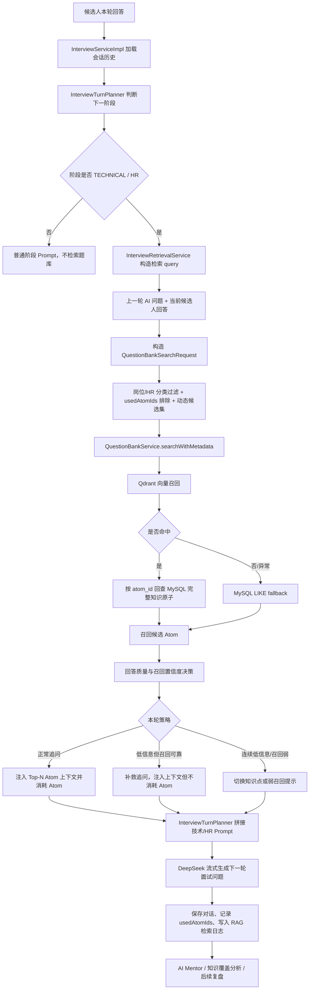

# InterWise RAG 链路与创新点总结

## 1. 一句话定位

InterWise 当前的 RAG 不是传统“知识库问答”的补充检索层，而是嵌入模拟面试流程中的“面试决策信号层”：系统会根据当前面试阶段、上一轮 AI 问题、候选人本轮回答质量、岗位方向、已覆盖知识点和题库召回置信度，动态决定本轮是否追问、补救追问、切换知识点，或只把题库作为弱参考。

也就是说，它的目标不是“给用户一个标准答案”，而是“帮助 AI 面试官像真实面试官一样追问、控场、覆盖知识点，并在面试结束后形成可复盘的数据资产”。

## 2. 当前 RAG 总链路

## 3. 分层说明

### 3.1 面试编排层：RAG 被阶段状态机控制

面试不是每一轮都无脑检索。`InterviewServiceImpl` 会先加载当前会话，再通过 `InterviewTurnPlanner.determineNextPhase(...)` 判断下一轮处于 `OPENING`、`TECHNICAL`、`HR`、`CLOSING` 还是 `FINISHED`。

只有当下一阶段是 `TECHNICAL` 或 `HR` 时，`InterviewRetrievalService` 才会构造题库检索请求。开场、自我介绍、收尾阶段不会强行拉知识库上下文。

这点和传统 RAG 最大不同在于：传统 RAG 通常由用户查询直接触发；InterWise 的 RAG 由面试阶段、面试任务和候选人表现共同触发。

关键实现：

- `backend/src/main/java/com/interview/service/impl/InterviewServiceImpl.java`
- `backend/src/main/java/com/interview/service/InterviewTurnPlanner.java`
- `backend/src/main/java/com/interview/service/InterviewRetrievalService.java`

### 3.2 Query 构造层：不是只拿用户回答检索

当前检索 query 由“上一轮 AI 问题 + 候选人当前回答”组成。

这样做是因为面试场景里，候选人的回答常常很短，比如“我不太清楚”“用过一点”“是通过向量数据库做的”。如果只用候选人的回答检索，语义会很弱；把上一轮 AI 问题拼进去后，系统能知道候选人是在回答哪个知识点，从而更容易召回相关 Atom。

传统知识库 RAG 更像是“用户主动提出一个完整问题”；InterWise 面试 RAG 更像是“系统理解候选人是在回答上一道题的哪一部分，并判断下一步该怎么追问”。

关键实现：

- `InterviewRetrievalService.buildQuery(...)`

### 3.3 召回层：岗位化过滤 + 已用 Atom 排除 + 动态候选集

检索请求会包含这些约束：

- `position`：根据岗位映射题库分类。
- `categories`：HR 阶段固定使用 `HR软技能` 分类；技术阶段按岗位方向过滤。
- `excludeAtomIds`：排除本场面试已经消耗过的知识原子，减少重复追问。
- `limit`：默认候选集 `APP_RAG_RETRIEVAL_LIMIT=20`，最大扩展到 `APP_RAG_RETRIEVAL_LIMIT_MAX=30`。

动态候选集的规则在 `RetrievalAnswerSignals` 中：如果候选人回答很短但包含明确技术信号，或回答里混合多个技术点，会临时扩大召回上限；低信息回答仍保持默认候选预算。

这不是固定 Top-K 检索，而是“候选人回答质量驱动的动态 RAG”。

关键实现：

- `backend/src/main/java/com/interview/service/RetrievalAnswerSignals.java`
- `backend/src/main/resources/application.yml`
- `.env.prod.example`

### 3.4 存储层：MySQL 是业务真相，Qdrant 是可重建语义索引

当前题库不是把文档切成普通 chunk 后丢进向量库，而是维护为结构化的 `KnowledgeAtom`：

- `atomId`
- `subject`
- `category`
- `difficulty`
- `principles`
- `pitfalls`
- `followUpPathsJson`
- `status`
- `vectorStatus`
- `lastIndexedAt`

MySQL 保存完整知识原子、状态流转、版本快照、导入批次和审核记录，是业务数据源。Qdrant 只保存向量和轻量 payload，例如 `atom_id`、`subject`、`category`、`difficulty`、`status`，用于语义召回。

检索时先从 Qdrant 拿到 `atom_id` 和 score，再回查 MySQL 取完整 Atom，拼成 Prompt 上下文。Qdrant 不可用或无命中时，会退回 MySQL LIKE fallback。

这个设计让题库可审核、可发布、可归档、可重建索引，也避免把向量库当业务数据库使用。

关键实现：

- `backend/src/main/java/com/interview/entity/KnowledgeAtom.java`
- `backend/src/main/java/com/interview/service/questionbank/QuestionBankService.java`
- `backend/src/main/java/com/interview/service/questionbank/QdrantVectorService.java`
- `docs/adr/0002-question-bank-import-lifecycle.md`

### 3.5 Embedding 与向量索引层

生产 Docker 默认使用独立 `embedding-service`，模型为 `intfloat/multilingual-e5-base`。生产 Qdrant collection 为：

- `QDRANT_COLLECTION=interview_atoms_e5_base`
- `QDRANT_VECTOR_SIZE=768`
- `APP_EMBEDDING_PROVIDER=http`
- `APP_EMBEDDING_ENDPOINT=http://embedding-service:8000/embed`
- `APP_EMBEDDING_QUERY_PREFIX=query:`
- `APP_EMBEDDING_PASSAGE_PREFIX=passage:`

本地普通 Java 运行仍可使用内置 `AllMiniLmL6V2EmbeddingModel`，方便不启动 Python 模型服务时调试。

`QdrantVectorService` 会在使用 collection 时校验向量维度。如果配置期望 768 维但实际 collection 是旧的 384 维，会拒绝使用该 collection，避免错误向量混写。

关键实现：

- `backend/src/main/java/com/interview/config/ChatConfig.java`
- `backend/src/main/java/com/interview/config/HttpEmbeddingModel.java`
- `backend/src/main/java/com/interview/service/questionbank/QdrantVectorService.java`
- `README.md`
- `PLAN.md`

### 3.6 决策层：RAG 不是直接回答，而是决定追问策略

`InterviewRetrievalService.decide(...)` 会结合候选人回答质量和召回分数做决策：

| 场景 | 系统行为 |
| --- | --- |
| 候选人回答正常，召回分数可用 | 注入题库上下文，并把本轮进入上下文的 Atom 记为已消耗 |
| 候选人回答低信息，但召回置信度高 | 进行低难度补救追问，注入上下文，但不消耗 Atom |
| 候选人连续低信息，或低信息且召回弱 | 切换到同岗位另一个核心知识点，不继续死追 |
| 召回置信度不足 | 明确提示模型不要强行使用题库上下文，改按面试历史和覆盖策略自然提问 |

这使得 RAG 从“答案来源”变成“面试官决策信号”。题库召回结果并不直接展示给用户，也不让模型把标准答案说出来，而是告诉面试官应该围绕哪个知识点、哪个缺失点继续问。

关键实现：

- `InterviewRetrievalService.decide(...)`
- `InterviewRetrievalService.selectContext(...)`

### 3.7 Prompt 注入层：Atom 被转成面试追问上下文

进入 Prompt 的 Atom 上下文包含：

- 考核点
- 核心原理与标准答案
- 面试常见陷阱与候选人易错点
- 推荐的深度追问路径

技术面 Prompt 明确要求：“选择最相关的 1 个追问，不要直接说出标准答案，优先追问候选人回答中缺失的部分”。HR 阶段则把题库上下文作为行为证据追问参考。

注意：`followUpPathsJson` 当前是 Prompt 引导，不是硬编码路径执行器。模型会参考它来追问，但系统还没有实现严格的路径状态机来强制逐节点执行。

关键实现：

- `QuestionBankService.buildPromptContext(...)`
- `InterviewTurnPlanner.buildSystemPrompt(...)`

### 3.8 会话记忆与覆盖控制

本场面试中真正被消费的 Atom 会写入 `usedAtomIds`：

- 生成下一轮问题完成后，`SessionStore.addUsedAtoms(...)` 追加本轮消耗的 Atom。
- 下一轮检索时，这些 Atom 会作为 `excludeAtomIds` 传给 Qdrant filter。
- 面试结束时，`usedAtomIds` 会持久化到 `interview_record.used_atom_ids`。

这让系统具备“本场知识点覆盖记忆”，避免同一个知识点反复追问，也为后续复盘提供依据。

补救追问场景会注入上下文但不消耗 Atom，这是一个细节：候选人还没有真正回答到位时，不应该把该知识点算作已经覆盖。

关键实现：

- `backend/src/main/java/com/interview/service/SessionStore.java`
- `backend/src/main/java/com/interview/service/impl/InterviewServiceImpl.java`
- `backend/src/main/resources/db/migration/V3__add_rag_tracking.sql`

### 3.9 可观测与复盘层

RAG 不只是运行时召回，还会写入两类日志：

- `rag_retrieval_request_log`：记录每次检索请求，包括阶段、query、requestedLimit、candidateCount、检索策略、延迟、状态和错误。
- `rag_retrieval_log`：记录每个候选 Atom，包括 atomId、category、similarityScore、rankIndex，以及是否真正进入 Prompt 上下文的 `contextSelected`。

AI Mentor 的知识覆盖分析只统计真正进入 Prompt context 的去重 Atom，而不是所有召回候选。这避免把“召回过但没使用”的候选误算为候选人已被考察过的知识点。

关键实现：

- `backend/src/main/java/com/interview/entity/RagRetrievalRequestLog.java`
- `backend/src/main/java/com/interview/entity/RagRetrievalLog.java`
- `backend/src/main/java/com/interview/service/MentorService.java`
- `backend/src/main/resources/db/migration/V11__add_rag_retrieval_request_log.sql`
- `backend/src/main/resources/db/migration/V12__track_rag_context_selection.sql`

## 4. 与传统 RAG 的核心差异

| 对比项 | 传统知识库 RAG | InterWise 当前 RAG |
| --- | --- | --- |
| 主要目标 | 回答用户问题 | 帮 AI 面试官选择追问方向 |
| 数据切分 | 文档 chunk | 结构化 Knowledge Atom |
| Query 来源 | 用户当前问题 | 上一轮 AI 问题 + 候选人当前回答 |
| 触发条件 | 用户提问即检索 | 受面试阶段控制，仅技术/HR 阶段检索 |
| 检索策略 | 固定 Top-K 较常见 | 默认 Top-20，技术信号强时动态扩到 Top-30，最终 Top-10 上下文 |
| 上下文作用 | 生成最终答案 | 作为面试追问依据，不直接暴露标准答案 |
| 对回答质量的处理 | 通常仍按 query 检索 | 低信息回答会补救追问、切换知识点或弱化召回 |
| 覆盖控制 | 通常无会话级知识点消耗 | usedAtomIds 排除已消费知识点 |
| 数据资产 | 文档片段 + 向量 | MySQL 题库生命周期 + Qdrant 可重建索引 |
| 复盘能力 | 多数只看回答文本 | 检索日志、上下文选中、知识覆盖、AI Mentor 联动 |

## 5. 创新点总结

### 5.1 动态面试 RAG

系统不是固定从题库拿 Top-K，而是根据候选人本轮回答动态决策：

- 回答有明确技术信号时，扩大候选集，提升召回覆盖。
- 回答过短或低信息时，不盲目深挖，而是补救或切换。
- 召回弱时，不强行把不可靠上下文塞给模型。

这让 RAG 更贴近真实面试官行为：不是为了“检索而检索”，而是根据候选人表现调整追问策略。

### 5.2 打通模拟面试和数据库题库

题库不再只是后台管理数据，而是直接影响模拟面试流程：

1. 维护者通过 Question Bank Admin 导入、校验、试运行、发布题库。
2. 发布后的 Atom 同步到 Qdrant。
3. 面试时按岗位和阶段召回 Atom。
4. Atom 的标准答案、误区、追问路径进入面试官 Prompt。
5. 面试完成后，实际使用过的 Atom 进入覆盖分析和 Mentor 复盘。

这条链路把“题库维护”和“AI 模拟面试”打通，形成一个闭环，而不是两个孤立模块。

### 5.3 知识原子替代普通文档 chunk

传统 RAG 常常把文档按长度切块，chunk 里可能混杂多个知识点。InterWise 使用 Knowledge Atom，每个 Atom 本身就是一个面试考核单元，包含考点、原理、误区和追问路径。

这种分块方式更适合面试，因为面试追问天然围绕“考核点”展开，而不是围绕文档页码或段落展开。

### 5.4 RAG 结果变成“决策信号”

当前 RAG 召回的不是给候选人的答案，而是给 AI 面试官的内部参考。Prompt 明确要求不要直接说出标准答案，而是围绕候选人缺失的部分继续追问。

这能降低“AI 把答案喂给候选人”的风险，也让系统更像面试官，而不是答疑机器人。

### 5.5 会话级知识覆盖记忆

`usedAtomIds` 让系统知道本场面试已经考察过哪些 Atom。下一轮检索会排除这些 Atom，减少重复问题，并在结束后形成知识覆盖记录。

这比传统 RAG 的“每轮独立检索”更适合长流程交互，因为面试关注的是整场覆盖面，而不是单轮答案质量。

### 5.6 可观测 RAG

项目记录请求级和候选级日志，能看到：

- 本轮 query 是什么
- 请求了多少候选
- 实际召回多少
- 用了 Qdrant 还是 MySQL fallback
- 每个 Atom 的相似度和排序
- 哪些 Atom 真正进入 Prompt

这让 RAG 从黑盒变成可评估、可调优、可复盘的工程模块，也能支撑后续 embedding 模型评测和 rerank 验证。

### 5.7 MySQL + Qdrant 的职责分离

一句话概括：MySQL 管业务真相，Qdrant 管语义索引。

MySQL 负责题库 CRUD、发布状态、版本、批次、审核、检索日志；Qdrant 负责向量召回和轻量过滤。Qdrant collection 可以通过全量 reindex 重建，避免向量库成为不可控的业务主库。

## 6. 当前边界与可继续增强点

当前实现已经具备动态检索、岗位过滤、低信息决策、usedAtom 排重、日志复盘和题库闭环，但还有几个边界需要明确：

1. `followUpPathsJson` 当前是 Prompt 引导，不是强约束路径执行器。如果要保证严格按路径走，需要额外设计追问路径状态机。
2. 生产链路当前没有正式引入 rerank。已有离线评测和 rerank 脚本思路，但上线前应先用人工评测集验证收益。
3. 当前不需要照搬传统知识库问答的复杂 query rewrite。面试场景更需要轻量语义归一、回答质量识别和阶段控制。
4. Qdrant 不可用时可降级 MySQL fallback，但语义质量会下降；生产验收应关注 Qdrant vector size、points count 和 reindex 结果。

## 7. 面试表达版本

如果在面试中被问“你这个 RAG 和传统 RAG 有什么不同”，可以这样回答：

> 我的项目里的 RAG 不是传统知识库问答那种“用户问问题、系统检索文档、再生成答案”。因为模拟面试的目标不是把答案告诉候选人，而是让 AI 面试官根据候选人的回答继续追问。
>
> 所以我把题库设计成 Knowledge Atom，每个 Atom 包含考核点、核心原理、常见误区和追问路径。面试过程中，系统会先根据显式状态机判断当前是不是技术面或 HR 阶段；如果需要检索，就用“上一轮 AI 问题 + 候选人当前回答”构造 query，再结合岗位分类、已问过的 Atom 黑名单和候选人回答质量去做动态召回。
>
> 召回结果不会直接展示给用户，而是作为 AI 面试官的内部决策信号：回答正常就围绕最相关知识点追问，回答很弱但召回可靠就做补救追问，连续低信息或召回弱就切换知识点。最后系统还会记录哪些 Atom 真正进入了 Prompt，用于知识覆盖分析和 AI Mentor 复盘。
>
> 所以这个 RAG 的创新点在于，它打通了数据库题库和模拟面试流程，让 RAG 从“回答生成模块”变成了“面试控场、追问决策和知识覆盖评估模块”。

## 8. 主要代码索引

- 面试主链路：`backend/src/main/java/com/interview/service/impl/InterviewServiceImpl.java`
- 阶段与 Prompt 编排：`backend/src/main/java/com/interview/service/InterviewTurnPlanner.java`
- RAG 检索与决策：`backend/src/main/java/com/interview/service/InterviewRetrievalService.java`
- 回答质量与动态候选集：`backend/src/main/java/com/interview/service/RetrievalAnswerSignals.java`
- 题库服务：`backend/src/main/java/com/interview/service/questionbank/QuestionBankService.java`
- Qdrant 向量服务：`backend/src/main/java/com/interview/service/questionbank/QdrantVectorService.java`
- Embedding 配置：`backend/src/main/java/com/interview/config/ChatConfig.java`
- HTTP Embedding 适配：`backend/src/main/java/com/interview/config/HttpEmbeddingModel.java`
- 知识原子实体：`backend/src/main/java/com/interview/entity/KnowledgeAtom.java`
- 检索日志实体：`backend/src/main/java/com/interview/entity/RagRetrievalRequestLog.java`、`backend/src/main/java/com/interview/entity/RagRetrievalLog.java`
- 题库管理接口：`backend/src/main/java/com/interview/controller/QuestionBankAdminController.java`
- 配置：`backend/src/main/resources/application.yml`、`.env.prod.example`
- 题库生命周期 ADR：`docs/adr/0002-question-bank-import-lifecycle.md`
