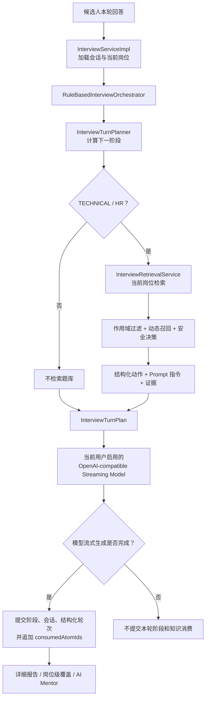
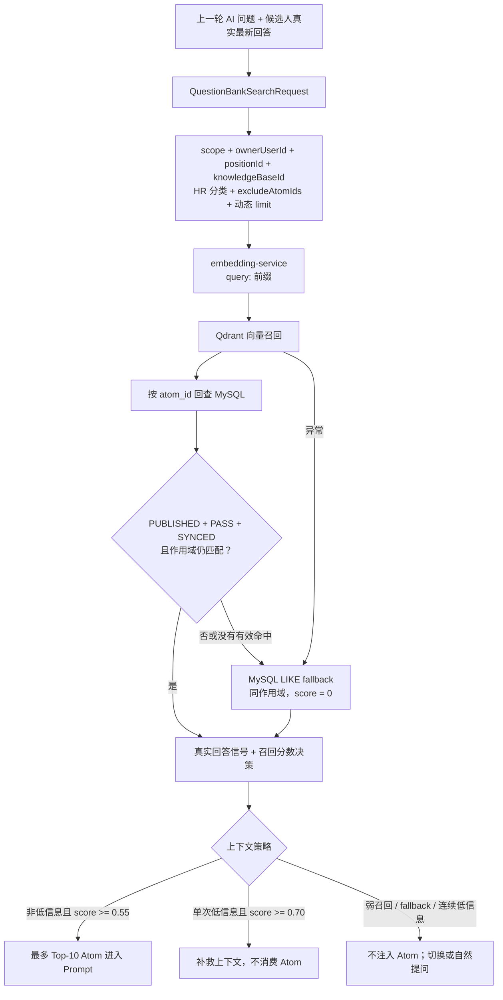
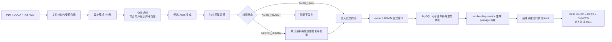

# InterWise RAG 链路与实现边界

> 本文描述当前稳定规则面试链路。规则版决策见 [ADR 0004](adr/0004-stable-rule-interview.md)，比赛版 Agent 资料已归档。

## 1. 一句话定位

InterWise 的面试由阶段状态机、动态 RAG 和流式生成组成：服务端规则计算下一阶段，在技术 / HR 阶段检索当前岗位题库，再根据候选人真实回答与召回分数决定自然推进、补救或换题。

RAG 证据在面试运行时只用于受控的下一问 Prompt，不会直接作为标准答案展示给候选人；模型流式生成完成后，系统还会保存当轮证据快照，供覆盖统计和异步详细报告复盘。

## 2. 当前总链路



面试只保留规则编排路径。检索依据的是状态机计算出的下一阶段：开场、收尾不检索，技术 / HR 阶段在合法岗位作用域内检索。当前岗位简历仍在面试启动时加载为定制题，岗位覆盖供报告与 Mentor 复盘。

## 3. 规则编排边界

`InterviewTurnPlanner` 负责阶段推进与基础 Prompt；`InterviewRetrievalService` 根据真实回答和检索结果，同时产出结构化动作、Prompt 指令与证据。动作不从中文 Prompt 反推，也不覆盖阶段状态机。

| 动作 | 用途 |
| --- | --- |
| `CONTINUE_PHASE` | 按计算出的阶段自然推进，可使用可靠的题库证据 |
| `REMEDIATE` | 单次低信息回答且召回高置信时提供补救提示 |
| `SWITCH_TOPIC` | 连续低信息，或低信息且召回未达高置信门槛时换题 |

`InterviewTurnPlan` 只保留六个字段：`phase`、`action`、`systemPrompt`、`evidenceContext`、`evidenceAtomIds`、`consumedAtomIds`。前两者说明阶段和规则动作；证据与消费分离，供成功生成后的快照与会话排重使用。

Tool Calling 规划、自动回退及专用配置、线程池、超时会话状态已移除；前端不再展示决策状态条，也不再接收 SSE `orchestration` 事件。新轮次仍把 `orchestration_mode` 写为 `RULE`，`decision_action` 写入规则动作，`decisionJson` 仅保存证据与消费 ID。V20 历史迁移、旧列与旧值保留，历史报告继续按问答和证据快照读取。

## 4. 检索子链路



### 4.1 Query 构造

query 只使用“上一轮 AI 问题 + 候选人真实最新回答”。上一问最多保留末尾 300 个字符，短回答因此仍有问题语义作为锚点。低信息判断、连续低信息判断与动态候选预算使用真实回答及历史回答，不使用模型改写的 query。

### 4.2 结构化作用域

正式检索的主约束不是旧式“岗位名称映射分类”，而是：

- `scope`：`PUBLIC` 或 `PRIVATE`。
- `ownerUserId`：公共题库必须为空；私有题库必须匹配 owner。
- `positionId`：当前面试绑定的结构化岗位。
- `knowledgeBaseId`：当前岗位绑定的知识库。
- `excludeAtomIds`：本场已消费 Atom，避免重复考察。
- `categories`：稳定规则进入 HR 时额外限定 `HR软技能`；技术检索不再依赖旧岗位分类映射。

面试难度会影响面试 Prompt，但当前不是检索过滤条件。没有合法结构化岗位 / 知识库作用域时，检索不会退回不受限的全局搜索。

### 4.3 双层检索门禁

Qdrant 先按发布、同步和结构化作用域过滤；命中后只返回 `atom_id + score`。服务端再回查 MySQL 完整 Atom，并要求：

```text
status = PUBLISHED
publication_status = PUBLISHED
review_status = PASS
vector_status = SYNCED
scope / owner / position / knowledge_base 全部匹配
```

`review_status` 不依赖 Qdrant payload，而由 MySQL 业务真相二次把关。MySQL fallback 也使用同一组业务条件。

### 4.4 MySQL fallback 的真实边界

Qdrant 异常、零命中或命中项经 MySQL 回查后失效时，系统会执行同作用域的 MySQL LIKE fallback，并记录降级策略。但当前 fallback 结果的分数固定为 `0.0`，低于默认上下文门槛 `0.55`，所以它不会作为题库证据注入 Prompt。

这是一条“主流程不中断、但不冒充语义召回质量”的安全降级路径，而不是低质量上下文替代 Qdrant 的路径。

### 4.5 动态候选与上下文预算

默认配置为：

- 候选召回 `APP_RAG_RETRIEVAL_LIMIT=20`。
- 技术信号较强或混合多个技术点时，最多扩到 `APP_RAG_RETRIEVAL_LIMIT_MAX=30`。
- 最多 `APP_RAG_CONTEXT_LIMIT=10` 个 Atom 进入 Prompt。
- 可用上下文阈值 `APP_RAG_MIN_CONTEXT_SCORE=0.55`。
- 高置信阈值 `APP_RAG_HIGH_CONFIDENCE_SCORE=0.70`。

这些是候选预算和安全阈值，不等同于线上 rerank。当前生产链路尚未启用正式 reranker。

## 5. Knowledge Atom、MySQL 与 Qdrant

### 5.1 Knowledge Atom

题库不是把原始文档 chunk 直接暴露给面试 RAG，而是维护结构化 `KnowledgeAtom`。它包括考核主题、分类、难度、核心原理、常见误区、追问路径、来源证据，以及 scope、owner、岗位、知识库、版本、审核、发布、向量同步等治理字段。

原始文档 chunk 是候选生成的输入，不等于正式可检索 Atom。

### 5.2 存储职责

- **MySQL**：用户、岗位、知识库、完整 Atom、审核与发布状态、构建批次、异步作业、面试轮次、报告和 RAG 日志的业务真相。
- **Qdrant**：可重建的语义索引，只保存向量和检索所需的轻量 payload。
- **embedding-service**：只把文本转换为向量，不直接读写 Qdrant。
- **Redis**：保存面试会话、已用 Atom、限流状态和 Mentor 缓存，不是题库真相来源。

Docker 默认使用 `intfloat/multilingual-e5-base`：query 添加 `query:` 前缀，Atom passage 添加 `passage:` 前缀，向量维度为 768，collection 默认为 `interview_atoms_e5_base`。直接运行 Java 后端时仍可使用 384 维 `AllMiniLmL6V2EmbeddingModel`；切换模型或 collection 后必须重建索引，不能混写不同维度。

## 6. 题库入库与发布治理



关键边界：

- 文件解析、分块、契约校验、作用域和状态流转由确定性程序控制；模型只负责候选生成、监督和受限修复。
- `AUTO_PASS` 不等于人工通过，更不等于自动发布。
- 机器状态与人工审核状态分离；终审只发布明确选择的合格候选。
- 私有构建只对 owner 可见；公共题库只能由 `ADMIN` 维护，但源文件、候选、批次和作业仍属于发起管理员的私有工件。
- 先提交 MySQL 业务状态，再执行可重试的 Qdrant 同步；索引失败项在恢复前不能进入面试上下文。
- 异步链路使用 MySQL `app_job`、本地 `TaskExecutor`、执行令牌和租约恢复，不依赖外部消息队列。
- 本机 JSON 导入是补充路径。通用导入只能形成带来源证据的 `NEEDS_REVIEW` 草稿，不能绕过终审写入 `PASS`。

## 7. 回答质量、消费与覆盖不是一回事

### 7.1 检索决策

稳定规则检索会结合低信息信号和召回分数：

| 场景 | 动作 | 上下文行为 | 会话消费 |
| --- | --- | --- | --- |
| 回答正常且召回可用 | `CONTINUE_PHASE` | 注入相关 Atom | 成功生成后消费 |
| 回答正常但召回弱 | `CONTINUE_PHASE` | 不注入 Atom，自然提问 | 不消费 |
| 单次低信息且召回高置信 | `REMEDIATE` | 注入补救证据 | 不消费 |
| 连续低信息，或低信息且召回未达高置信门槛 | `SWITCH_TOPIC` | 不注入 Atom，提示换题 | 不消费 |
| MySQL fallback | 按回答信号继续或换题 | 记录降级候选，因 score=0 不注入 | 不消费 |

补救可以同时具备非空 `evidenceAtomIds` 与空 `consumedAtomIds`，不能通过是否消费来判断本轮是否注入了证据。

### 7.2 三类记录

- **候选召回**：`rag_retrieval_request_log` 和 `rag_retrieval_log` 在规划检索阶段写入，可用于定位零命中、降级、分数、排序与候选是否被选入上下文；即使后续生成失败，它们也可能存在。
- **会话消费**：`consumedAtomIds` 只在模型的流式完成回调（`onComplete`）中追加到 SessionStore，用于本场下一轮排重；补救上下文不消费。
- **已落库轮次证据**：成功生成的轮次把计划的 `evidenceAtomIds` 保存到 `interview_turn.retrieved_atom_ids`，同时保存问答和证据上下文快照。岗位级覆盖与 Mentor 从这些已落库轮次统计，而不是直接把检索日志当成已生成并落库的问题。

这里的完成指模型触发 `onComplete`：代码先保存记录，再发送 SSE `done` 事件；当前没有浏览器接收确认机制，因此不代表客户端已完整收到问题。

覆盖率表达“哪些知识点进入过已生成并落库的问题上下文”，不代表候选人已经掌握这些知识点。补救上下文虽然不进入会话消费集合，但问题生成并落库后仍属于知识暴露，可进入覆盖统计。

当前覆盖分母查询的是该岗位全部 `status=PUBLISHED` Atom，分子也只要求已落库轮次中的 Atom 当前仍为 `PUBLISHED`。这与正式 RAG 的 `PUBLISHED + PASS + SYNCED` 门禁并不相同；文档不能把两者混写。若产品希望覆盖分母严格等于“当前可检索全集”，需要另行统一查询条件并补回归测试。

## 8. 报告与 AI Mentor

面试结束后，系统先同步形成初步评估，再分别调度异步详细报告和岗位级 Mentor 缓存刷新：

- 详细报告读取成功落库的技术 / HR 轮次及当轮 RAG 快照，生成逐题参考、评分和来源说明。
- AI Mentor 按 `userId + positionId` 聚合该岗位历史、风险和覆盖，不跨岗位混合诊断。

报告和 Mentor 是并列的复盘消费者，不应画成 RAG 请求必须串行经过 Mentor 才完成。

## 9. 与传统 RAG 的差异

| 对比项 | 传统知识库 RAG | InterWise 当前实现 |
| --- | --- | --- |
| 主要目标 | 回答用户问题 | 决定下一问并支持岗位训练复盘 |
| 数据单元 | 原始文档 chunk | 经治理的 Knowledge Atom |
| 检索触发 | 用户提问即检索 | 规则计算出技术 / HR 阶段时检索 |
| Query | 用户当前问题 | 上一轮 AI 问题 + 候选人真实最新回答 |
| 作用域 | 常见为知识库过滤 | scope + owner + position + knowledge base 强绑定 |
| 质量门 | 常见为相似度阈值 | Qdrant 过滤 + MySQL `PUBLISHED + PASS + SYNCED` 回查 |
| 上下文用途 | 生成最终答案 | 生成追问，禁止直接暴露标准答案 |
| 失败策略 | 空答或备用检索 | 保持面试可用，但 fallback 不伪装成可靠语义上下文 |
| 长流程记忆 | 常见为每轮独立检索 | 会话消费排重 + 成功轮次知识暴露 |
| 复盘 | 多数只看回答文本 | 结构化轮次、检索日志、岗位覆盖、报告与 Mentor |

## 10. 当前边界与后续增强

已确认的当前边界：

1. `followUpPathsJson` 是 Prompt 引导，不是强约束的逐节点路径状态机。
2. 生产链路尚未启用正式 rerank；仓库已有离线评测工具，应先用固定评测集验证收益再上线。
3. MySQL fallback 当前不会注入 Prompt。如果未来希望它提供可用上下文，需要单独设计词法分数、阈值和评测，不能直接抬高 0 分结果。
4. 规则负责阶段与检索提示，下一问文本仍由用户模型生成。移除规划模型调用本身不能证明追问质量提高或量化 Token / 延迟收益。
5. 知识覆盖是“考察 / 暴露覆盖”，不是掌握度；掌握度仍需结合回答评分和多次训练变化判断。当前覆盖分母仅过滤 `PUBLISHED`，与正式检索门禁不同，属于需要明确评估的口径差异。

## 11. 面试表达版本

> InterWise 用服务端状态机推进面试，在技术 / HR 阶段检索当前岗位题库。检索 query 来自上一问和候选人的真实回答，规则根据回答质量与召回分数给出自然推进、补救或换题提示，再交给模型生成下一问。
>
> 题库使用结构化 Knowledge Atom，而不是把原始文档 chunk 直接上线。只有与当前 scope、owner、岗位和知识库匹配，并且 `PUBLISHED + PASS + SYNCED` 的 Atom 才可能进入下一问 Prompt；Qdrant 命中后还要回查 MySQL。
>
> 检索证据用于追问提示，标准答案不会直接展示给候选人。系统分别记录检索候选、会话消费和已落库轮次证据；补救可以有证据但不消费。这样既能做本场排重，也能为岗位覆盖、详细报告和 AI Mentor 保存复盘依据。

## 12. 主要代码与决策索引

- 面试主链路：`backend/src/main/java/com/interview/service/impl/InterviewServiceImpl.java`
- 阶段与 Prompt：`backend/src/main/java/com/interview/service/InterviewTurnPlanner.java`
- RAG 检索与安全决策：`backend/src/main/java/com/interview/service/InterviewRetrievalService.java`
- 回答信号与动态候选集：`backend/src/main/java/com/interview/service/RetrievalAnswerSignals.java`
- 规则编排与计划：`backend/src/main/java/com/interview/service/orchestration/RuleBasedInterviewOrchestrator.java`、`InterviewTurnPlan.java`
- 题库检索与 MySQL 回查：`backend/src/main/java/com/interview/service/questionbank/QuestionBankSearchService.java`
- Qdrant 向量服务：`backend/src/main/java/com/interview/service/questionbank/QdrantVectorService.java`
- 题库构建与终审：`backend/src/main/java/com/interview/service/questionbank/build/QuestionBankBuildJobHandler.java`、`QuestionBankBuildSupervisionRunner.java`、`QuestionBankBuildFinalizationJobHandler.java`
- 异步作业恢复：`backend/src/main/java/com/interview/service/AppJobRecoveryService.java`
- 岗位级覆盖与 Mentor：`backend/src/main/java/com/interview/service/MentorService.java`
- Embedding 配置：`backend/src/main/java/com/interview/config/ChatConfig.java`、`HttpEmbeddingModel.java`
- 数据模型：`backend/src/main/java/com/interview/entity/KnowledgeAtom.java`、`InterviewTurn.java`、`RagRetrievalRequestLog.java`、`RagRetrievalLog.java`
- 工作台：`frontend/src/views/KnowledgeWorkspace.vue`
- 配置：`backend/src/main/resources/application.yml`、`.env.example`、`.env.prod.example`
- 架构决策：[ADR 0004](adr/0004-stable-rule-interview.md)、[ADR 0002](adr/0002-in-app-question-bank-build-agent.md)、[ADR 0003](adr/0003-controlled-question-bank-ingestion-pipeline.md)；[ADR 0001](adr/0001-bounded-interview-agent.md) 已取代。
