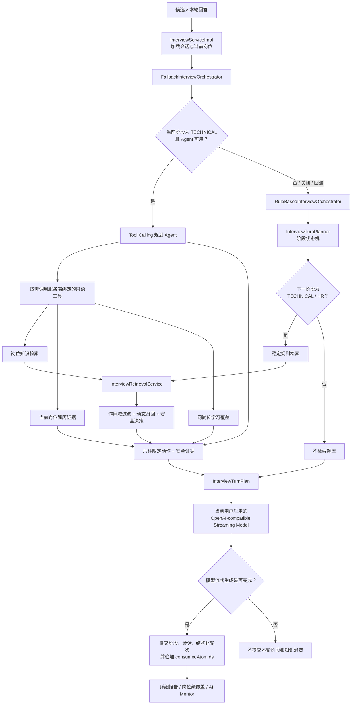
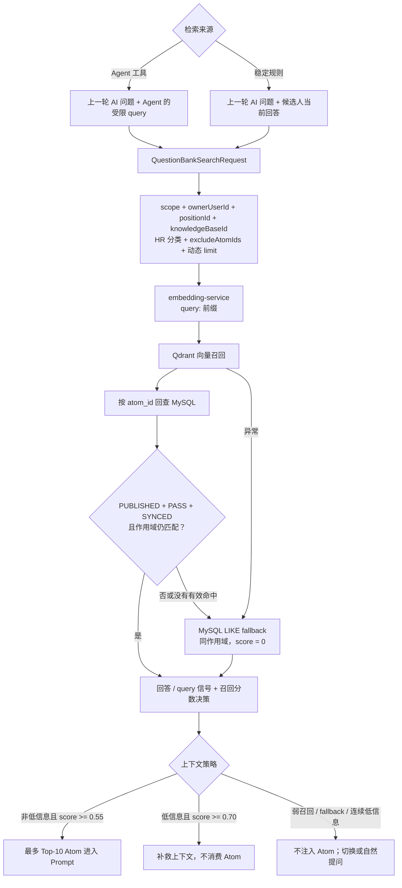
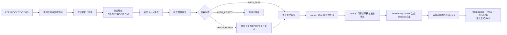

# InterWise RAG 链路与实现边界

> 本文描述当前 `master` 的实际实现。架构图不绑定产品版本号；本次审校基线为正式版 `v1.5.0` 加其后的未发布变更。

## 1. 一句话定位

InterWise 不是传统“检索资料后替用户回答”的知识库问答，而是一套有边界的单轮 Agentic RAG：它把岗位题库、当前岗位简历和岗位学习覆盖作为只读证据，帮助 AI 面试官决定下一问是继续深挖、补救、换题、追问项目、保持阶段还是进入 HR。

RAG 证据在面试运行时只用于受控的下一问 Prompt，不会直接作为标准答案展示给候选人；模型流式生成完成后，系统还会保存当轮证据快照，供覆盖统计和异步详细报告复盘。

## 2. 当前总链路



这里有两条必须区分的路径：

- **Agent 路径**：只在当前阶段为 `TECHNICAL` 且 Agent 可用时启用。规划 Agent 可以不检索题库，也可以选择简历或覆盖工具。
- **稳定规则路径**：开场、HR、收尾、Agent 关闭或失败时启用。只有其计算出的下一阶段为 `TECHNICAL` 或 `HR` 时才检索题库。

因此，“技术 / HR 阶段会检索”只准确描述稳定规则路径；不能再概括成所有技术轮都固定先检索。

## 3. 面试编排与 Agent 边界

### 3.1 限定动作

技术轮规划 Agent 最终只能返回以下动作：

- `DEEPEN`：围绕已有技术证据继续深挖。
- `REMEDIATE`：降低跨度，补救关键概念。
- `SWITCH_TOPIC`：切换到同岗位其他知识点。
- `PROBE_RESUME`：依据当前岗位绑定的简历证据追问。
- `MOVE_TO_HR`：满足轮次门槛后进入 HR。
- `CONTINUE_PHASE`：保持当前阶段自然推进。

动作必须通过严格 JSON 契约返回，并真正影响下一问 Prompt 或阶段。模型不能创建新工具、写题库、修改作用域，或自行指定 `userId`、`positionId`、`recordId`。

### 3.2 三个只读工具

规划 Agent 单轮最多调用 3 次工具，并优先只调用最相关的一个：

1. `searchPositionKnowledge(query)`：在服务端绑定的当前岗位 / 知识库作用域内检索。
2. `getCurrentResumeEvidence()`：读取当前用户绑定到当前岗位的简历证据。
3. `getPositionLearningCoverage()`：读取当前用户在当前岗位的覆盖数据，不触发 Mentor LLM。

### 3.3 失败回退

- Agent 关闭或非技术阶段：直接使用稳定规则。
- 首次规划超时：仅当前轮回退，下一技术轮重试 Agent。
- 连续第二次超时：本场面试固定回退稳定规则。
- Provider、工具、JSON 契约或其他规划错误：本场面试固定回退稳定规则。

前端和数据库只接收模式、动作、工具名、安全摘要、证据 Atom ID 和白名单失败分类；不保存思维链、Provider 原始错误、Token 或密钥。

## 4. 检索子链路



### 4.1 Query 构造

两条路径的 query 不相同：

- 稳定规则路径使用“上一轮 AI 问题 + 候选人当前回答”。短回答也能保留上一问的语义锚点。
- Agent 路径使用“上一轮 AI 问题 + Agent 传入的自然语言检索 query”。规划 Agent 的上层上下文包含候选人回答，但检索服务的低信息判断针对工具 query，而不是直接针对原回答。

### 4.2 结构化作用域

正式检索的主约束不是旧式“岗位名称映射分类”，而是：

- `scope`：`PUBLIC` 或 `PRIVATE`。
- `ownerUserId`：公共题库必须为空；私有题库必须匹配 owner。
- `positionId`：当前面试绑定的结构化岗位。
- `knowledgeBaseId`：当前岗位绑定的知识库。
- `excludeAtomIds`：本场已消费 Atom，避免重复考察。
- `categories`：稳定规则进入 HR 时额外限定 `HR软技能`；技术检索不再依赖旧岗位分类映射。

面试难度会影响面试 Prompt，但当前不是检索过滤条件。没有合法结构化岗位 / 知识库作用域时，检索不会退回不受限的全局搜索。

### 4.3 双层检索门禁

Qdrant 先按发布、同步和结构化作用域过滤；命中后只返回 `atom_id + score`。服务端再回查 MySQL 完整 Atom，并要求：

```text
status = PUBLISHED
publication_status = PUBLISHED
review_status = PASS
vector_status = SYNCED
scope / owner / position / knowledge_base 全部匹配
```

`review_status` 不依赖 Qdrant payload，而由 MySQL 业务真相二次把关。MySQL fallback 也使用同一组业务条件。

### 4.4 MySQL fallback 的真实边界

Qdrant 异常、零命中或命中项经 MySQL 回查后失效时，系统会执行同作用域的 MySQL LIKE fallback，并记录降级策略。但当前 fallback 结果的分数固定为 `0.0`，低于默认上下文门槛 `0.55`，所以它不会作为题库证据注入 Prompt。

这是一条“主流程不中断、但不冒充语义召回质量”的安全降级路径，而不是低质量上下文替代 Qdrant 的路径。

### 4.5 动态候选与上下文预算

默认配置为：

- 候选召回 `APP_RAG_RETRIEVAL_LIMIT=20`。
- 技术信号较强或混合多个技术点时，最多扩到 `APP_RAG_RETRIEVAL_LIMIT_MAX=30`。
- 最多 `APP_RAG_CONTEXT_LIMIT=10` 个 Atom 进入 Prompt。
- 可用上下文阈值 `APP_RAG_MIN_CONTEXT_SCORE=0.55`。
- 高置信阈值 `APP_RAG_HIGH_CONFIDENCE_SCORE=0.70`。

这些是候选预算和安全阈值，不等同于线上 rerank。当前生产链路尚未启用正式 reranker。

## 5. Knowledge Atom、MySQL 与 Qdrant

### 5.1 Knowledge Atom

题库不是把原始文档 chunk 直接暴露给面试 RAG，而是维护结构化 `KnowledgeAtom`。它包括考核主题、分类、难度、核心原理、常见误区、追问路径、来源证据，以及 scope、owner、岗位、知识库、版本、审核、发布、向量同步等治理字段。

原始文档 chunk 是候选生成的输入，不等于正式可检索 Atom。

### 5.2 存储职责

- **MySQL**：用户、岗位、知识库、完整 Atom、审核与发布状态、构建批次、异步作业、面试轮次、报告和 RAG 日志的业务真相。
- **Qdrant**：可重建的语义索引，只保存向量和检索所需的轻量 payload。
- **embedding-service**：只把文本转换为向量，不直接读写 Qdrant。
- **Redis**：保存面试会话、已用 Atom、限流状态和 Mentor 缓存，不是题库真相来源。

Docker 默认使用 `intfloat/multilingual-e5-base`：query 添加 `query:` 前缀，Atom passage 添加 `passage:` 前缀，向量维度为 768，collection 默认为 `interview_atoms_e5_base`。直接运行 Java 后端时仍可使用 384 维 `AllMiniLmL6V2EmbeddingModel`；切换模型或 collection 后必须重建索引，不能混写不同维度。

## 6. 题库入库与发布治理



关键边界：

- 文件解析、分块、契约校验、作用域和状态流转由确定性程序控制；模型只负责候选生成、监督和受限修复。
- `AUTO_PASS` 不等于人工通过，更不等于自动发布。
- 机器状态与人工审核状态分离；终审只发布明确选择的合格候选。
- 私有构建只对 owner 可见；公共题库只能由 `ADMIN` 维护，但源文件、候选、批次和作业仍属于发起管理员的私有工件。
- 先提交 MySQL 业务状态，再执行可重试的 Qdrant 同步；索引失败项在恢复前不能进入面试上下文。
- 异步链路使用 MySQL `app_job`、本地 `TaskExecutor`、执行令牌和租约恢复，不依赖外部消息队列。
- 本机 JSON 导入是补充路径。通用导入只能形成带来源证据的 `NEEDS_REVIEW` 草稿，不能绕过终审写入 `PASS`。

## 7. 回答质量、消费与覆盖不是一回事

### 7.1 检索决策

稳定规则检索会结合低信息信号和召回分数：

| 场景 | 上下文行为 | 会话消费 |
| --- | --- | --- |
| 回答正常且召回可用 | 注入相关 Atom | 成功生成后消费 |
| 低信息但召回高置信 | 注入补救上下文 | 不消费 |
| 连续低信息或召回弱 | 不注入 Atom，切换或自然提问 | 不消费 |
| MySQL fallback | 记录降级候选，因 score=0 不注入 | 不消费 |

在 Agent 路径中，这些结果先作为知识工具证据返回，最终仍由限定动作契约决定下一问；Agent 也可以完全不调用知识工具。

### 7.2 三类记录

- **候选召回**：`rag_retrieval_request_log` 和 `rag_retrieval_log` 在规划检索阶段写入，可用于定位零命中、降级、分数、排序与候选是否被选入上下文；即使后续生成失败，它们也可能存在。
- **会话消费**：`consumedAtomIds` 只在模型的流式完成回调（`onComplete`）中追加到 SessionStore，用于本场下一轮排重；补救上下文不消费。
- **已落库轮次证据**：成功生成的轮次把 `promptAtomIds` 保存到 `interview_turn.retrieved_atom_ids`。岗位级覆盖与 Mentor 从这些已落库轮次统计，而不是直接把规划日志当成已生成并落库的问题。

这里的完成指模型触发 `onComplete`：代码先保存记录，再发送 SSE `done` 事件；当前没有浏览器接收确认机制，因此不代表客户端已完整收到问题。

覆盖率表达“哪些知识点进入过已生成并落库的问题上下文”，不代表候选人已经掌握这些知识点。补救上下文虽然不进入会话消费集合，但问题生成并落库后仍属于知识暴露，可进入覆盖统计。

当前覆盖分母查询的是该岗位全部 `status=PUBLISHED` Atom，分子也只要求已落库轮次中的 Atom 当前仍为 `PUBLISHED`。这与正式 RAG 的 `PUBLISHED + PASS + SYNCED` 门禁并不相同；文档不能把两者混写。若产品希望覆盖分母严格等于“当前可检索全集”，需要另行统一查询条件并补回归测试。

## 8. 报告与 AI Mentor

面试结束后，系统先同步形成初步评估，再分别调度异步详细报告和岗位级 Mentor 缓存刷新：

- 详细报告读取成功落库的技术 / HR 轮次及当轮 RAG 快照，生成逐题参考、评分和来源说明。
- AI Mentor 按 `userId + positionId` 聚合该岗位历史、风险和覆盖，不跨岗位混合诊断。
- Agent 的覆盖工具只读取覆盖数据，不触发 Mentor 模型调用。

报告和 Mentor 是并列的复盘消费者，不应画成 RAG 请求必须串行经过 Mentor 才完成。

## 9. 与传统 RAG 的差异

| 对比项 | 传统知识库 RAG | InterWise 当前实现 |
| --- | --- | --- |
| 主要目标 | 回答用户问题 | 决定下一问并支持岗位训练复盘 |
| 数据单元 | 原始文档 chunk | 经治理的 Knowledge Atom |
| 检索触发 | 用户提问即检索 | Agent 技术轮按需；稳定规则按阶段 |
| Query | 用户当前问题 | 规则：上一问 + 当前回答；Agent：上一问 + 工具 query |
| 作用域 | 常见为知识库过滤 | scope + owner + position + knowledge base 强绑定 |
| 质量门 | 常见为相似度阈值 | Qdrant 过滤 + MySQL `PUBLISHED + PASS + SYNCED` 回查 |
| 上下文用途 | 生成最终答案 | 生成追问，禁止直接暴露标准答案 |
| 失败策略 | 空答或备用检索 | 保持面试可用，但 fallback 不伪装成可靠语义上下文 |
| 长流程记忆 | 常见为每轮独立检索 | 会话消费排重 + 成功轮次知识暴露 |
| 复盘 | 多数只看回答文本 | 结构化轮次、检索日志、岗位覆盖、报告与 Mentor |

## 10. 当前边界与后续增强

已确认的当前边界：

1. `followUpPathsJson` 是 Prompt 引导，不是强约束的逐节点路径状态机。
2. 生产链路尚未启用正式 rerank；仓库已有离线评测工具，应先用固定评测集验证收益再上线。
3. MySQL fallback 当前不会注入 Prompt。如果未来希望它提供可用上下文，需要单独设计词法分数、阈值和评测，不能直接抬高 0 分结果。
4. Agent 工具路径的回答质量信号实际针对工具 query；若要直接利用候选人原回答，应在接口中显式分离 `answer` 与 `query`，而不是在文档中假定两者相同。
5. 知识覆盖是“考察 / 暴露覆盖”，不是掌握度；掌握度仍需结合回答评分和多次训练变化判断。当前覆盖分母仅过滤 `PUBLISHED`，与正式检索门禁不同，属于需要明确评估的口径差异。

## 11. 面试表达版本

> InterWise 的 RAG 不是替候选人回答问题，而是给 AI 面试官提供受控证据。技术阶段先由有边界的单轮 Agent 决定要不要查岗位知识、当前岗位简历或学习覆盖；Agent 不可用时仍有阶段状态机和稳定规则托底。
>
> 题库使用结构化 Knowledge Atom，而不是把原始文档 chunk 直接上线。只有与当前 scope、owner、岗位和知识库匹配，并且 `PUBLISHED + PASS + SYNCED` 的 Atom 才可能进入下一问 Prompt；Qdrant 命中后还要回查 MySQL。
>
> 检索结果只用来决定深挖、补救或换题，不直接把标准答案展示给候选人。系统还把规划候选、会话消费和已落库轮次证据分开记录，所以能做本场排重、岗位覆盖、详细报告和 AI Mentor 复盘。这更准确地说是一套受控 Agentic RAG，而不是开放式多 Agent 或普通问答 RAG。

## 12. 主要代码与决策索引

- 面试主链路：`backend/src/main/java/com/interview/service/impl/InterviewServiceImpl.java`
- 阶段与 Prompt：`backend/src/main/java/com/interview/service/InterviewTurnPlanner.java`
- RAG 检索与安全决策：`backend/src/main/java/com/interview/service/InterviewRetrievalService.java`
- 回答信号与动态候选集：`backend/src/main/java/com/interview/service/RetrievalAnswerSignals.java`
- Agent / 回退 / 规则编排：`backend/src/main/java/com/interview/service/orchestration/ToolCallingInterviewOrchestrator.java`、`FallbackInterviewOrchestrator.java`、`RuleBasedInterviewOrchestrator.java`
- 题库检索与 MySQL 回查：`backend/src/main/java/com/interview/service/questionbank/QuestionBankSearchService.java`
- Qdrant 向量服务：`backend/src/main/java/com/interview/service/questionbank/QdrantVectorService.java`
- 题库构建与终审：`backend/src/main/java/com/interview/service/questionbank/build/QuestionBankBuildJobHandler.java`、`QuestionBankBuildSupervisionRunner.java`、`QuestionBankBuildFinalizationJobHandler.java`
- 异步作业恢复：`backend/src/main/java/com/interview/service/AppJobRecoveryService.java`
- 岗位级覆盖与 Mentor：`backend/src/main/java/com/interview/service/MentorService.java`
- Embedding 配置：`backend/src/main/java/com/interview/config/ChatConfig.java`、`HttpEmbeddingModel.java`
- 数据模型：`backend/src/main/java/com/interview/entity/KnowledgeAtom.java`、`InterviewTurn.java`、`RagRetrievalRequestLog.java`、`RagRetrievalLog.java`
- 工作台：`frontend/src/views/KnowledgeWorkspace.vue`
- 配置：`backend/src/main/resources/application.yml`、`.env.example`、`.env.prod.example`
- 架构决策：[ADR 0001](adr/0001-bounded-interview-agent.md)、[ADR 0002](adr/0002-in-app-question-bank-build-agent.md)、[ADR 0003](adr/0003-controlled-question-bank-ingestion-pipeline.md)
